---
## Front matter
lang: ru-RU
title: Лабораторная работа №1
subtitle: Операционные системы
author:
  - Ермакова А.А.
institute:
  - Российский университет дружбы народов, Москва, Россия
date: 07 марта 2025

## i18n babel
babel-lang: russian
babel-otherlangs: english

## Formatting pdf
toc: false
toc-title: Содержание
slide_level: 2
aspectratio: 169
section-titles: true
theme: metropolis
header-includes:
 - \metroset{progressbar=frametitle,sectionpage=progressbar,numbering=fraction}
---

# Информация

## Докладчик

:::::::::::::: {.columns align=center}
::: {.column width="70%"}

  * Ермакова Анастасия Алексеевна, НКАбд-02-24
  * студентка факультета физико-математических и естественных наук
  * Российский университет дружбы народов
  * [1132246718@rudn.ru](mailto:1132246718@rudn.ru)
  * <https://aannyyaa1.github.io/ru/>

:::
::: {.column width="30%"}

:::
::::::::::::::

## Цели работы

- Создать шаблон презентации в Markdown
- Описать алгоритм создания выходных форматов презентаций

## Установка Linux на Virtualbox

Устанавливаю Линукс на виртуальную машину.

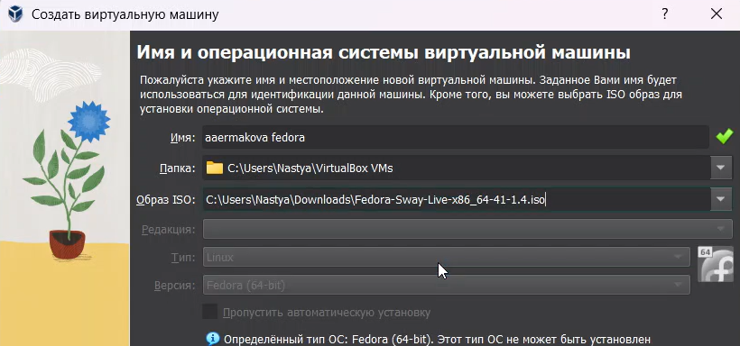

## Установка Linux на Virtualbox

У меня она имеет следующие характеристики.

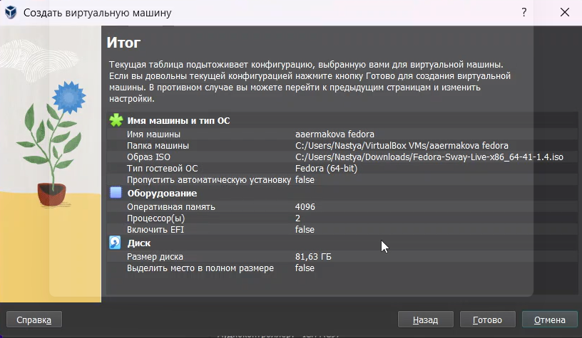

## Работа с операционной системой после установки

Вхожу в ОС, нажимаю комбинацию Win+Enter для запуска терминала и переключаюсь на роль супер-пользователя.

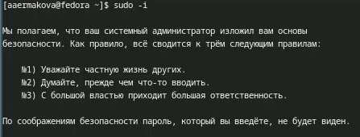

## Работа с операционной системой после установки

Устанавливаю средства разработки.

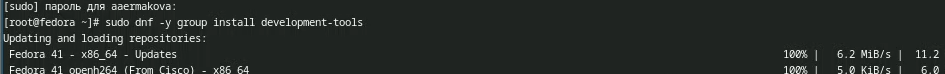

Обновляю пакеты.

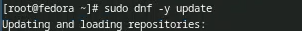

## Работа с операционной системой после установки

Устанавливаю программу для удобства работы в консоли.

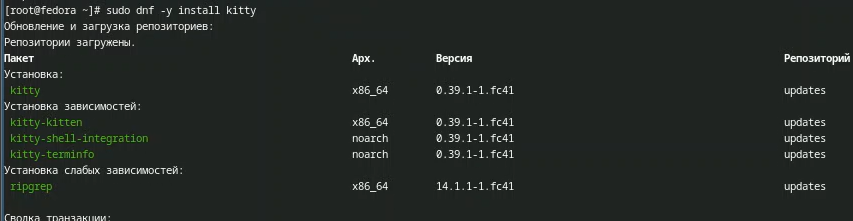

## Работа с операционной системой после установки

Устанавливаю программное обеспечение для автоматического обновления.

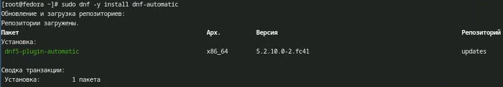

Запускаю таймер.

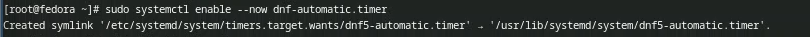

## Работа с операционной системой после установки

Для отключение SELinux необходимо использовать Midnight Commander, установлю его с помощью команды sudo dnf install mc.

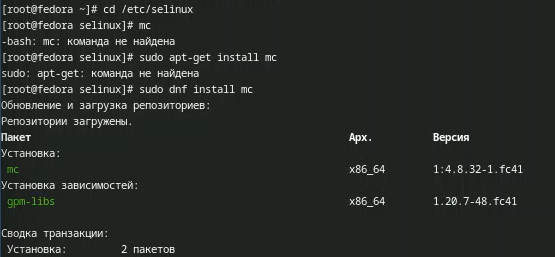

## Работа с операционной системой после установки

После установки перехожу в каталог selinux и захожу в mc.

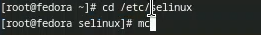

Открываю файл и вношу в него изменения.

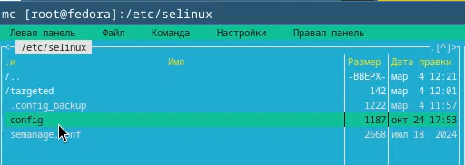

## Работа с операционной системой после установки

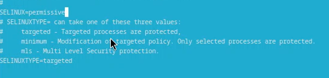

Перезапускаю виртуальную машину.

## Настройка раскладки клавиатуры

Снова захожу в ОС, запускаю терминал и запускаю терминальный мультиплексор tmux.

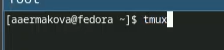

Создаю конфигурационный файл и перехожу в mc для его дальнейшей редакции.

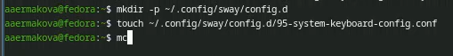

## Настройка раскладки клавиатуры

Вношу изменения в файл.

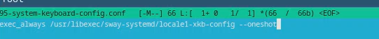

Переключаюсь на роль супер-пользователя и снова захожу в mc.

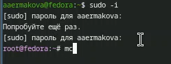

## Настройка раскладки клавиатуры

Редактирую другой конфигурационный файл.

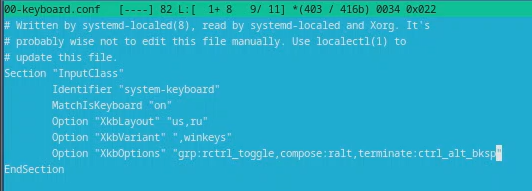

Перезагружаю виртуальную машину.

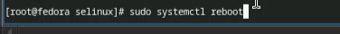

## Установка программного обеспечения для создания документации

Запускаю терминальный мультиплексор, переключаюсь на роль супер-пользователя и устанавливаю pandoc.

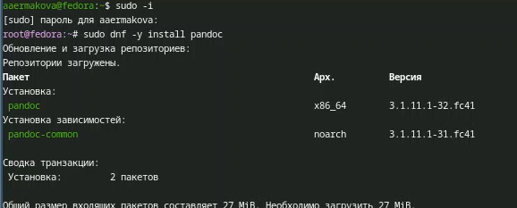

## Установка программного обеспечения для создания документации

Затем устанавливаю texlive.

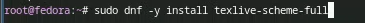

Устанавливаю пакеты pandoc и pandoc-crossref с github.

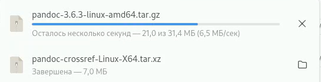

## Установка программного обеспечения для создания документации

Через mc копирую файлы в нужный каталог. Все готово.

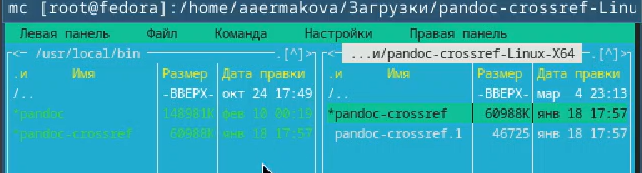

## Домашнее задание 

Открываю терминал, выполняю команду dmesg | less.

## Домашнее задание 

Далее получаю с помощью этой информации необходимую информацию.

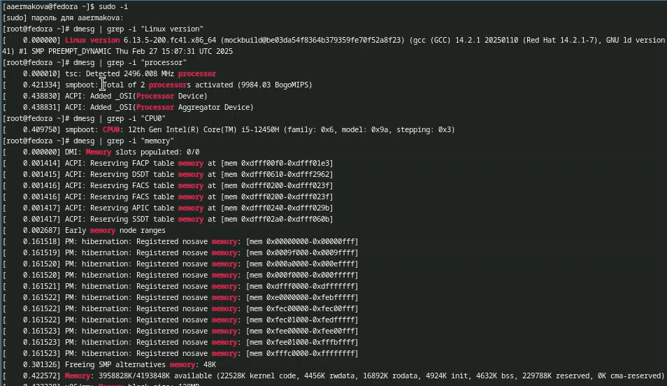

## Домашнее задание 
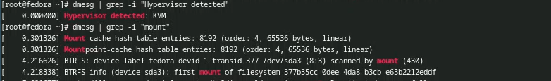

# Выводы

В ходе выполнения данной лабораторной работы я преобрела практиические навыки установки
операционной системв на виртуальную машину, настройки минимально необходимых для 
дальнейшей работы серверов. 
