---
## Front matter
title: "Отчет по лабораторной работе №1"
subtitle: "Операционные системы"
author: "Ермакова Анастасия Алексеевна"

## Generic otions
lang: ru-RU
toc-title: "Содержание"

## Bibliography
bibliography: bib/cite.bib
csl: pandoc/csl/gost-r-7-0-5-2008-numeric.csl

## Pdf output format
toc: true # Table of contents
toc-depth: 2
lof: true # List of figures
lot: true # List of tables
fontsize: 12pt
linestretch: 1.5
papersize: a4
documentclass: scrreprt
## I18n polyglossia
polyglossia-lang:
  name: russian
  options:
	- spelling=modern
	- babelshorthands=true
polyglossia-otherlangs:
  name: english
## I18n babel
babel-lang: russian
babel-otherlangs: english
## Fonts
mainfont: IBM Plex Serif
romanfont: IBM Plex Serif
sansfont: IBM Plex Sans
monofont: IBM Plex Mono
mathfont: STIX Two Math
mainfontoptions: Ligatures=Common,Ligatures=TeX,Scale=0.94
romanfontoptions: Ligatures=Common,Ligatures=TeX,Scale=0.94
sansfontoptions: Ligatures=Common,Ligatures=TeX,Scale=MatchLowercase,Scale=0.94
monofontoptions: Scale=MatchLowercase,Scale=0.94,FakeStretch=0.9
mathfontoptions:
## Biblatex
biblatex: true
biblio-style: "gost-numeric"
biblatexoptions:
  - parentracker=true
  - backend=biber
  - hyperref=auto
  - language=auto
  - autolang=other*
  - citestyle=gost-numeric
## Pandoc-crossref LaTeX customization
figureTitle: "Рис."
tableTitle: "Таблица"
listingTitle: "Листинг"
lofTitle: "Список иллюстраций"
lotTitle: "Список таблиц"
lolTitle: "Листинги"
## Misc options
indent: true
header-includes:
  - \usepackage{indentfirst}
  - \usepackage{float} # keep figures where there are in the text
  - \floatplacement{figure}{H} # keep figures where there are in the text
---

# Цель работы

Целью данной работы является приобретение практических навыков установки операционной системы на виртуальную машину, настройки минимально необходимых
для дальнейшей работы сервисов.

# Задание

1. Установка Linux на Virtualbox
2. Работа с операционной системой после установки
3. Настройка раскладки клавиатуры
3. Установка программного обеспечения для создания документации
4. Домашнее задание

# Выполнение лабораторной работы
## Установка Linux на Virtualbox

Устанавливаю Линукс на виртуальную машину (рис. [-@fig:001]).

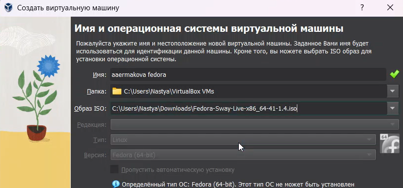{#fig:001 width=70%}

У меня она имеет следующие характеристики (рис. [-@fig:002]).

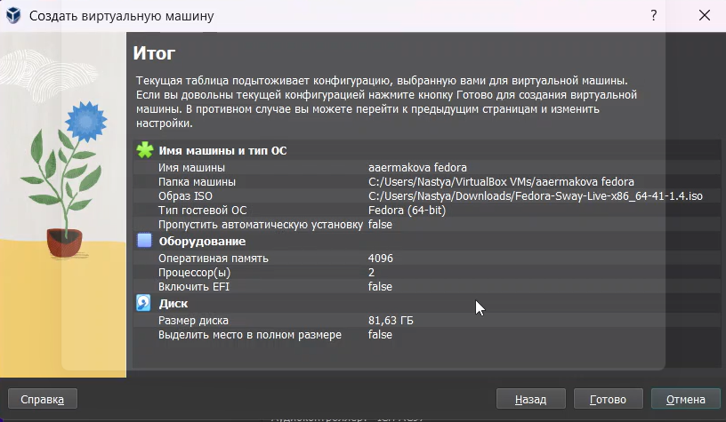{#fig:002 width=70%}

## Работа с операционной системой после установки

Вхожу в ОС, нажимаю комбинацию Win+Enter для запуска терминала и переключаюсь на роль супер-пользователя (рис. [-@fig:003]).

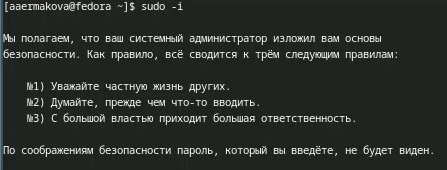{#fig:003 width=70%}

Устанавливаю средства разработки (рис. [-@fig:004]).

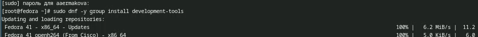{#fig:004 width=70%}

Обновляю пакеты (рис. [-@fig:005]).

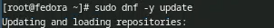{#fig:005 width=70%}

Устанавливаю программу для удобства работы в консоли (рис. [-@fig:006]).

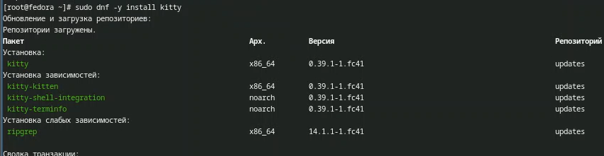{#fig:006 width=70%}

Устанавливаю программное обеспечение для автоматического обновления (рис. [-@fig:007]).

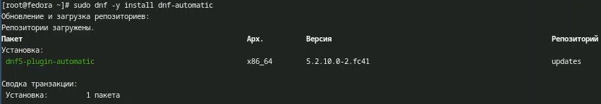{#fig:007 width=70%}

Запускаю таймер (рис. [-@fig:008]).

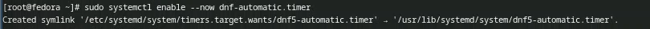{#fig:008 width=70%}

Для отключение SELinux необходимо использовать Midnight Commander, установлю его с помощью команды sudo dnf install mc (рис. [-@fig:009]).

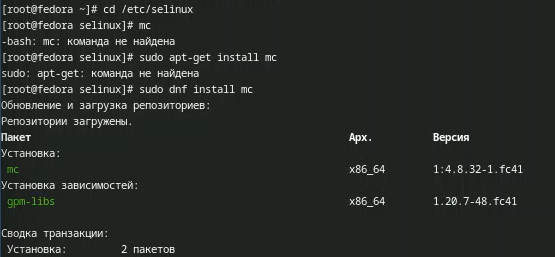{#fig:009 width=70%}

После установки перехожу в каталог selinux и захожу в mc (рис. [-@fig:010]).

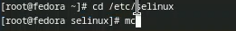{#fig:010 width=70%}

Открываю файл и вношу в него изменения (рис. [-@fig:011]-[-@fig:012]).

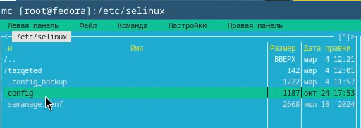{#fig:011 width=70%}

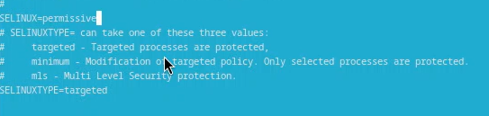{#fig:012 width=70%}

Перезапускаю виртуальную машину (рис. [-@fig:013]).

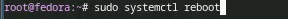{#fig:013 width=70%}

## Настройка раскладки клавиатуры

Снова захожу в ОС, запускаю терминал и запускаю терминальный мультиплексор tmux (рис. [-@fig:014]).

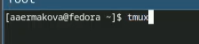{#fig:014 width=70%}

Создаю конфигурационный файл и перехожу в mc для его дальнейшей редакции (рис. [-@fig:015]).

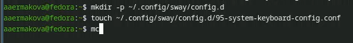{#fig:015 width=70%}

Вношу изменения в файл (рис. [-@fig:016]).

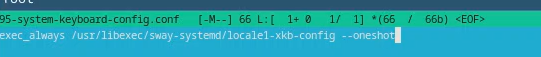{#fig:016 width=70%}

Переключаюсь на роль супер-пользователя и снова захожу в mc (рис. [-@fig:017]).

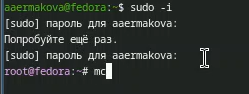{#fig:017 width=70%}

Редактирую другой конфигурационный файл (рис. [-@fig:018]).

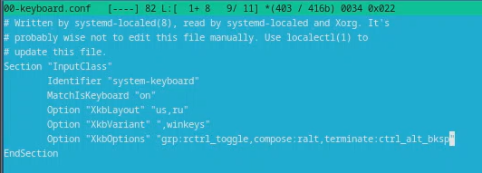{#fig:018 width=70%}

Перезагружаю виртуальную машину (рис. [-@fig:019]).

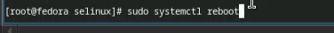{#fig:019 width=70%}

## Установка программного обеспечения для создания документации

Запускаю терминальный мультиплексор, переключаюсь на роль супер-пользователя и устанавливаю pandoc (рис. [-@fig:020]).

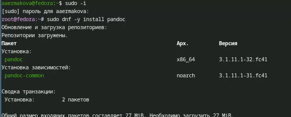{#fig:020 width=70%}

Затем устанавливаю texlive (рис. [-@fig:021]).

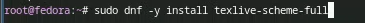{#fig:021 width=70%}

Устанавливаю пакеты pandoc и pandoc-crossref с github (рис. [-@fig:022]).

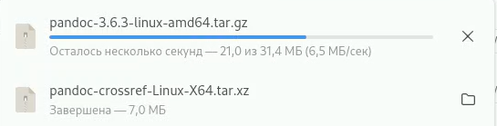{#fig:022 width=70%}

Через mc копирую файлы в нужный каталог (рис. [-@fig:023]). Все готово.

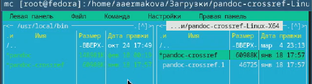{#fig:023 width=70%}

## Домашнее задание 

Открываю терминал, выполняю команду dmesg | less (рис. [-@fig:024]).

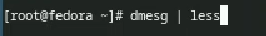{#fig:024 width=70%}

Далее получаю с помощью этой информации необходимую информацию (рис. [-@fig:025]-[-@fig:026]).

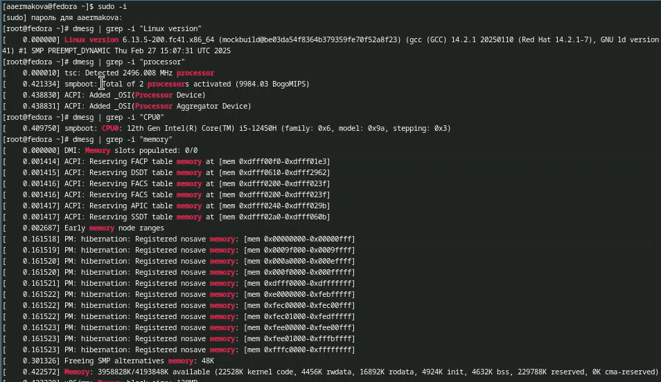{#fig:025 width=70%}

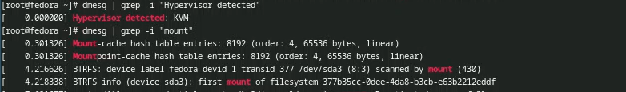{#fig:026 width=70%}

# Выводы

В ходе выполнения данной лабораторной работы я преобрела практиические навыки установки
операционной системв на виртуальную машину, настройки минимально необходимых для 
дальнейшей работы серверов. 

# Список литературы

::: {#refs}
::: 

