---
## Front matter
lang: ru-RU
title: Лабораторная работа №2
subtitle: Операционные системы
author:
  - Ермакова А.А.
institute:
  - Российский университет дружбы народов, Москва, Россия
date: 08 марта 2025

## i18n babel
babel-lang: russian
babel-otherlangs: english

## Formatting pdf
toc: false
toc-title: Содержание
slide_level: 2
aspectratio: 169
section-titles: true
theme: metropolis
header-includes:
 - \metroset{progressbar=frametitle,sectionpage=progressbar,numbering=fraction}
---

# Информация

## Докладчик

:::::::::::::: {.columns align=center}
::: {.column width="70%"}

  * Ермакова Анастасия Алексеевна, НКАбд-02-24
  * студентка факультета физико-математических и естественных наук
  * Российский университет дружбы народов
  * [1132246718@rudn.ru](mailto:1132246718@rudn.ru)
  * <https://aannyyaa1.github.io/ru/>

:::
::: {.column width="30%"}

:::
::::::::::::::

## Цели работы

- Изучить идеологию и применение средств контроля версий.
- Освоить умения по работе с git.

## Задание

1. Создать базовую конфигурацию для работы с git
2. Создать ключ SSH
3. Создать ключ GPG
4. Настроить подписи Git
5. Зарегистрироваться на GitHub
6. Создать локальный каталог для выполнения заданий по предмету

## Теоретическое введение

Системы контроля версий (Version Control System, VCS) применяются при работе нескольких человек над одним проектом. Обычно основное дерево проекта 
хранится в локальном или удалённом репозитории, к которому настроен доступ для участников проекта. При внесении изменений в содержание проекта 
система контроля версий позволяет их фиксировать, совмещать изменения, произведённые разными участниками проекта, производить откат к любой более 
ранней версии проекта, если это требуется.

# Выполнение лабораторной работы
## Установка программного обеспечения

Первым делом открываю терминал, переключаюсь на роль суперпользователя и прописываю команду для установки git. Он уже оказался установлен.

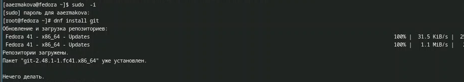

## Установка программного обеспечения

Далее устанавливаю gh.

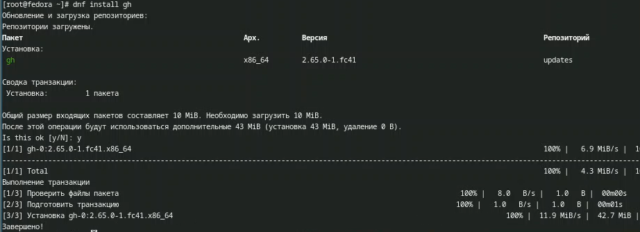

## Базовая настройка git

Задаю имя и email владельца репозитория (меня). 

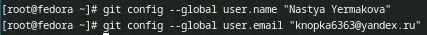

Настраиваю utf-8 в выводе сообщений git.

## Базовая настройка git

Задаю имя начальной ветки master, параметр autocrlf и параметр safecrlf.

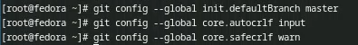

## Создание ключа ssh

Сначала создаю ключ по алгоритму ed25519.

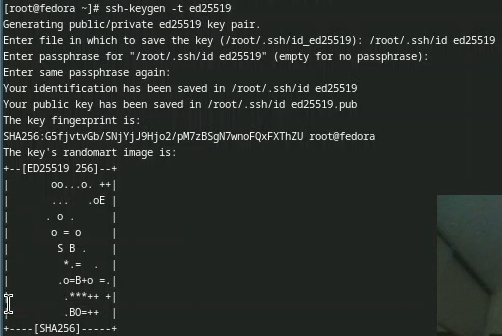

## Создание ключа ssh

Затем по алгоритму rsa с ключем размером 4096 бит.
 
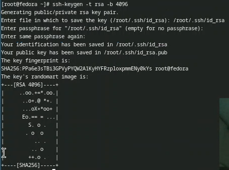

## Создание ключа pgp

Генерирую ключи. Из предложенных опций выбираю те, что указаны по заданию.

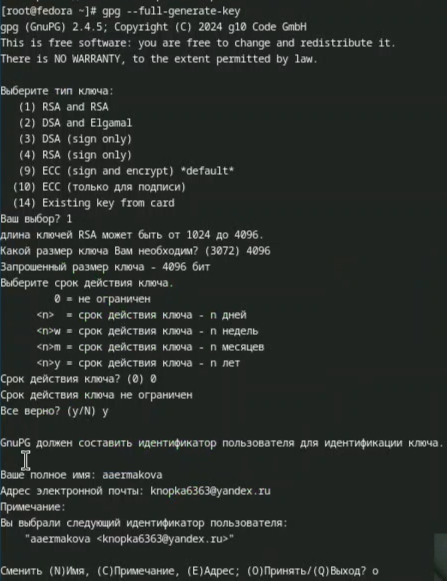

## Настройка github

У меня уже был создан аккаунт, поэтому этот пункт я пропускаю.

## Добавление PGP ключа в GitHub

Вывожу список ключей. Мне нужен первый.

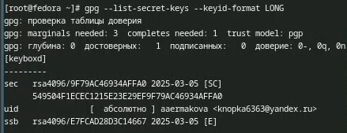

## Добавление PGP ключа в GitHub

Вместо неустановленной команды хсlір вывожу ключ на экран с помощью комнады gpg --armor --export ключ.

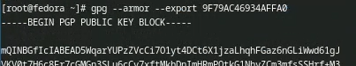

## Добавление PGP ключа в GitHub

Перехожу в настройки GitHub, нажимаю кнопку New GPG key и вставляю полученный ключ в поле ввода. Добавляю его.

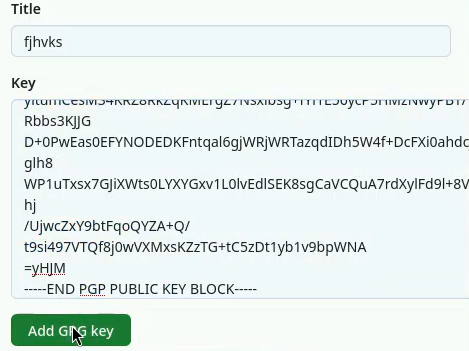

## Добавление PGP ключа в GitHub

Ключ добавлен.

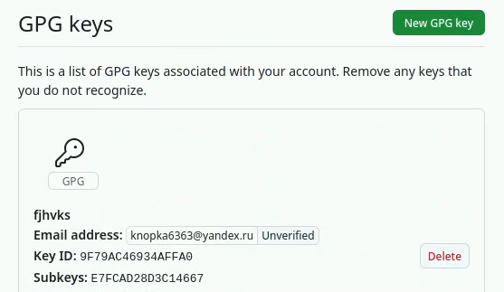

## Настройка автоматических подписей коммитов git

Используя введенный email, указываю Git применять его при подписи коммитов.
 
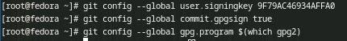

## Настройка gh
 
Авторизуюсь через браузер.
 
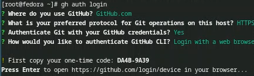

## Настройка gh

Авторизация прошла успешно.
 
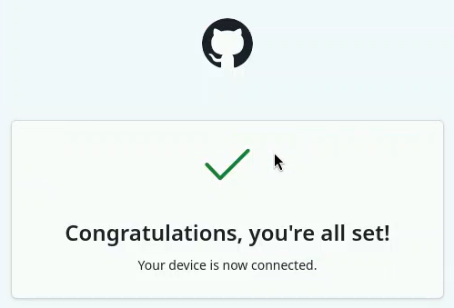
 
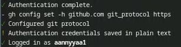

## Шаблон для рабочего пространства
 
Создаю репозиторий курса на основе шаблона рабочего пространства. Создаю сам каталог, перехожу в него и прописываю команду для создания репозитория,
указывая шаблон. Клонирую репозиторий.
 
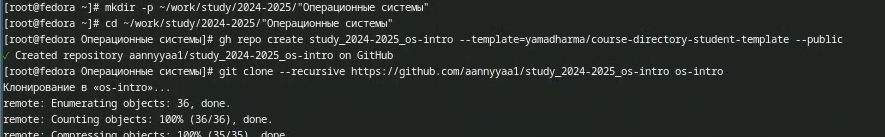

## Шаблон для рабочего пространства
 
Далее настраиваю каталог курса. Для этого перехожу в этот каталог, удаляю лишние файлы, создаю необходимые каталоги.
 
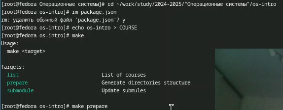

## Шаблон для рабочего пространства

Отправляю файлы на сервер.
 
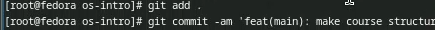
 
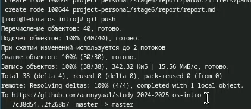

# Выводы

В ходе выполнения данной лабораторной работы я изучила идеологию и применение средств контроля версий и освоила умения по работе с git.

