---
## Front matter
title: "Отчет по лабораторной работе №2"
subtitle: "Операционные системы"
author: "Ермакова Анастасия Алексеевна"

## Generic otions
lang: ru-RU
toc-title: "Содержание"

## Bibliography
bibliography: bib/cite.bib
csl: pandoc/csl/gost-r-7-0-5-2008-numeric.csl

## Pdf output format
toc: true # Table of contents
toc-depth: 2
lof: true # List of figures
lot: true # List of tables
fontsize: 12pt
linestretch: 1.5
papersize: a4
documentclass: scrreprt
## I18n polyglossia
polyglossia-lang:
  name: russian
  options:
	- spelling=modern
	- babelshorthands=true
polyglossia-otherlangs:
  name: english
## I18n babel
babel-lang: russian
babel-otherlangs: english
## Fonts
mainfont: IBM Plex Serif
romanfont: IBM Plex Serif
sansfont: IBM Plex Sans
monofont: IBM Plex Mono
mathfont: STIX Two Math
mainfontoptions: Ligatures=Common,Ligatures=TeX,Scale=0.94
romanfontoptions: Ligatures=Common,Ligatures=TeX,Scale=0.94
sansfontoptions: Ligatures=Common,Ligatures=TeX,Scale=MatchLowercase,Scale=0.94
monofontoptions: Scale=MatchLowercase,Scale=0.94,FakeStretch=0.9
mathfontoptions:
## Biblatex
biblatex: true
biblio-style: "gost-numeric"
biblatexoptions:
  - parentracker=true
  - backend=biber
  - hyperref=auto
  - language=auto
  - autolang=other*
  - citestyle=gost-numeric
## Pandoc-crossref LaTeX customization
figureTitle: "Рис."
tableTitle: "Таблица"
listingTitle: "Листинг"
lofTitle: "Список иллюстраций"
lotTitle: "Список таблиц"
lolTitle: "Листинги"
## Misc options
indent: true
header-includes:
  - \usepackage{indentfirst}
  - \usepackage{float} # keep figures where there are in the text
  - \floatplacement{figure}{H} # keep figures where there are in the text
---

# Цель работы

- Изучить идеологию и применение средств контроля версий.
- Освоить умения по работе с git.

# Задание

1. Создать базовую конфигурацию для работы с git
2. Создать ключ SSH
3. Создать ключ GPG
4. Настроить подписи Git
5. Зарегистрироваться на GitHub
6. Создать локальный каталог для выполнения заданий по предмету

# Теоретическое введение

Системы контроля версий (Version Control System, VCS) применяются при работе нескольких человек над одним проектом. Обычно основное дерево проекта 
хранится в локальном или удалённом репозитории, к которому настроен доступ для участников проекта. При внесении изменений в содержание проекта 
система контроля версий позволяет их фиксировать, совмещать изменения, произведённые разными участниками проекта, производить откат к любой более 
ранней версии проекта, если это требуется.

# Выполнение лабораторной работы
## Установка программного обеспечения

Первым делом открываю терминал, переключаюсь на роль суперпользователя и прописываю команду для установки git (рис. [-@fig:001]). Он уже оказался установлен.

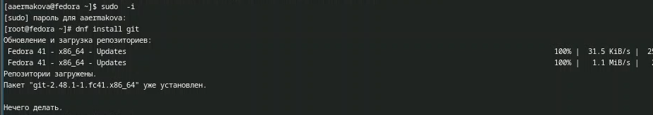{#fig:001 width=70%}

Далее устанавливаю gh (рис. [-@fig:002]).

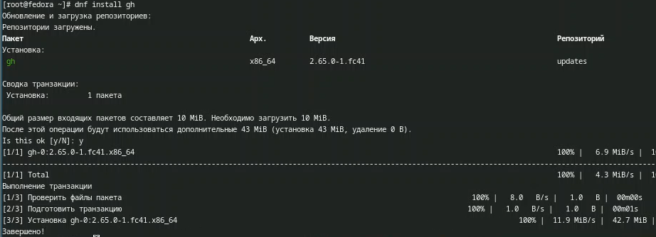{#fig:002 width=70%}

## Базовая настройка git

Задаю имя и email владельца репозитория (меня) (рис. [-@fig:003]).

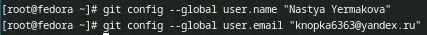{#fig:003 width=70%}

Настраиваю utf-8 в выводе сообщений git (рис. [-@fig:004]).

{#fig:004 width=70%}

Задаю имя начальной ветки master, параметр autocrlf и параметр safecrlf (рис. [-@fig:005]).

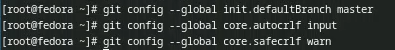{#fig:005 width=70%}

## Создание ключа ssh

Сначала создаю ключ по алгоритму ed25519 (рис. [-@fig:006]).

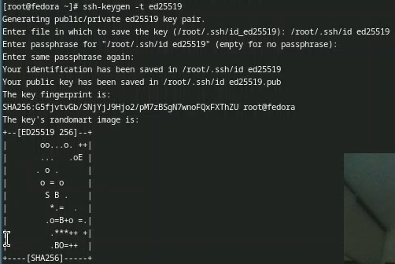{#fig:006 width=70%}

Затем по алгоритму rsa с ключем размером 4096 бит (рис. [-@fig:007]).
 
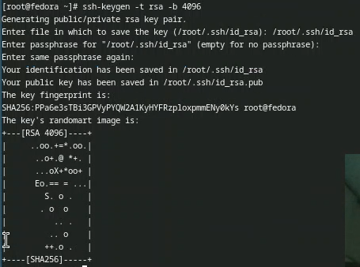{#fig:007 width=70%}

## Создание ключа pgp

Генерирую ключи (рис. [-@fig:008]). Из предложенных опций выбираю те, что указаны по заданию.

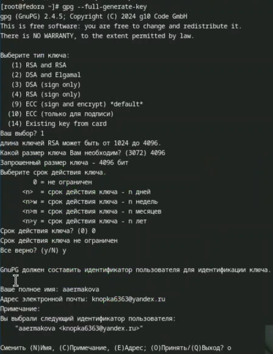{#fig:008 width=70%}

## Настройка github

У меня уже был создан аккаунт, поэтому этот пункт я пропускаю.

## Добавление PGP ключа в GitHub

Вывожу список ключей (рис. [-@fig:009]). Мне нужен первый.

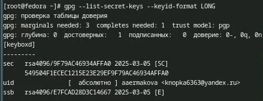{#fig:009 width=70%}

Вместо неустановленной команды хсlір вывожу ключ на экран с помощью комнады gpg --armor --export ключ. (рис. [-@fig:010]).

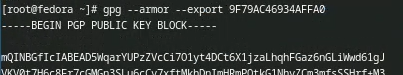{#fig:010 width=70%}

Перехожу в настройки GitHub, нажимаю кнопку New GPG key и вставляю полученный ключ в поле ввода. Добавляю его. (рис. [-@fig:011]).

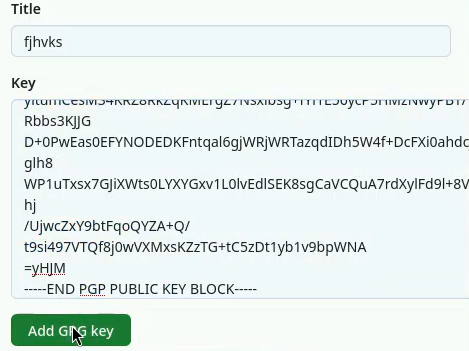{#fig:011 width=70%}

Ключ добавлен (рис. [-@fig:012]).

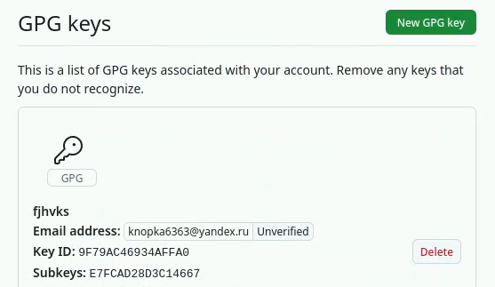{#fig:012 width=70%}

## Настройка автоматических подписей коммитов git

Используя введенный email, указываю Git применять его при подписи коммитов (рис. [-@fig:013]).
 
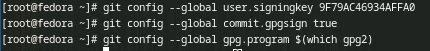{#fig:013 width=70%}

## Настройка gh
 
Авторизуюсь через браузер (рис. [-@fig:014]).
 
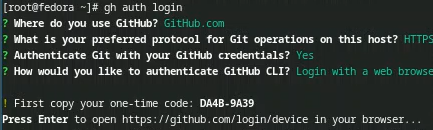{#fig:014 width=70%}

Авторизация прошла успешно (рис. [-@fig:015]-[-@fig:016]).
 
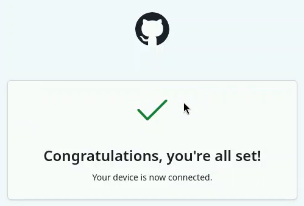{#fig:015 width=70%}
 
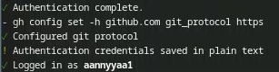{#fig:016 width=70%}

## Шаблон для рабочего пространства
 
Создаю репозиторий курса на основе шаблона рабочего пространства. Создаю сам каталог, перехожу в него и прописываю команду для создания репозитория,
указывая шаблон. Клонирую репозиторий. (рис. [-@fig:017]).
 
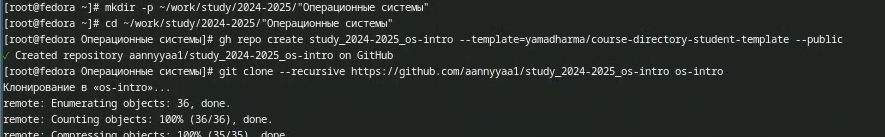{#fig:017 width=70%}
 
Далее настраиваю каталог курса. Для этого перехожу в этот каталог, удаляю лишние файлы, создаю необходимые каталоги (рис. [-@fig:018]).
 
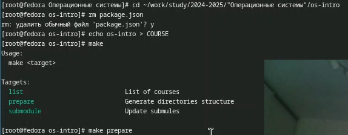{#fig:018 width=70%}

Отправляю файлы на сервер (рис. [-@fig:019]-[-@fig:020] ).
 
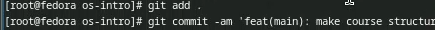{#fig:019 width=70%}
 
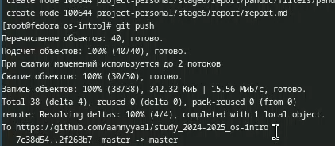{#fig:020 width=70%}

# Выводы

В ходе выполнения данной лабораторной работы я изучила идеологию и применение средств контроля версий и освоила умения по работе с git.

# Список литературы
::: {#refs}
:::
