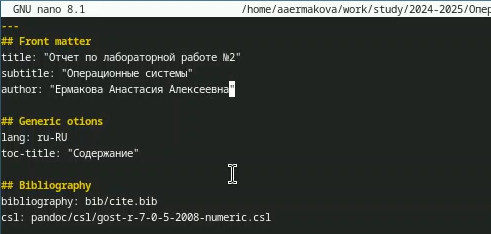
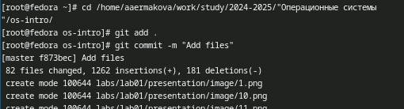
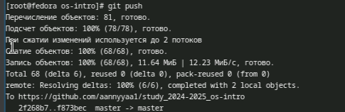

---
## Front matter
lang: ru-RU
title: Лабораторная работа №3
subtitle: Операционные системы
author:
  - Ермакова А.А.
institute:
  - Российский университет дружбы народов, Москва, Россия
date: 08 марта 2025

## i18n babel
babel-lang: russian
babel-otherlangs: english

## Formatting pdf
toc: false
toc-title: Содержание
slide_level: 2
aspectratio: 169
section-titles: true
theme: metropolis
header-includes:
 - \metroset{progressbar=frametitle,sectionpage=progressbar,numbering=fraction}
---

# Информация

## Докладчик

:::::::::::::: {.columns align=center}
::: {.column width="70%"}

  * Ермакова Анастасия Алексеевна, НКАбд-02-24
  * студентка факультета физико-математических и естественных наук
  * Российский университет дружбы народов
  * [1132246718@rudn.ru](mailto:1132246718@rudn.ru)
  * <https://aannyyaa1.github.io/ru/>

:::
::: {.column width="30%"}

:::
::::::::::::::

## Цели работы

Научиться оформлять отчеты с помощью легкословестного языка разметки Markdown.

## Задание

- Сделать отчет по предыдущей лабораторной работе в формате Markdown.
- В качестве отчета предоставить отчеты в 3 форматах: pdf, docx и md.

## Выполнение лабораторной работы 

Захожу в терминал, получаю роль супер-пользователя и открываю файл с отчетом через текстовый редактор nano.

Начинаю работу с файлом отчета.

## Выполнение лабораторной работы

По завершению работы над файлом сохраняю изменения в нем и в терминале перехожу в каталог с лабораторными работами и отправляю все файлы на GitHub.

## Выполнение лабораторной работы

И наконец использую git push.

# Выводы

В ходе выполнения данной лабораторной работы я научилась оформлять отчеты с 
помощью легкословестного языка разметки Markdown.
