---
## Front matter
lang: ru-RU
title: Лабораторная работа №4
subtitle: Операционные системы
author:
  - Ермакова А.А.
institute:
  - Российский университет дружбы народов, Москва, Россия
date: 08 марта 2025

## i18n babel
babel-lang: russian
babel-otherlangs: english

## Formatting pdf
toc: false
toc-title: Содержание
slide_level: 2
aspectratio: 169
section-titles: true
theme: metropolis
header-includes:
 - \metroset{progressbar=frametitle,sectionpage=progressbar,numbering=fraction}
---

# Информация

## Докладчик

:::::::::::::: {.columns align=center}
::: {.column width="70%"}

  * Ермакова Анастасия Алексеевна, НКАбд-02-24
  * студентка факультета физико-математических и естественных наук
  * Российский университет дружбы народов
  * [1132246718@rudn.ru](mailto:1132246718@rudn.ru)
  * <https://aannyyaa1.github.io/ru/>

:::
::: {.column width="30%"}

:::
::::::::::::::

## Цель работы

Получение навыков правильной работы с репозиторием git.

## Задание

- Выполнить работу для тестового репозитория
- Преобразовать рабочий репозиторий в репозиторий с git-flow и conventional commits

## Теоретическое введение

- Gitflow Workflow опубликована и популяризована Винсентом Дриссеном.
- Gitflow Workflow предполагает выстраивание строгой модели ветвления с учётом выпуска проекта.
- Данная модель отлично подходит для организации рабочего процесса на основе релизов.
- Работа по модели Gitflow включает создание отдельной ветки для исправлений ошибок в рабочей среде.

# Выполнение лабораторной работы
## Установка git-flow

Установка из коллекции репозиториев Corp.

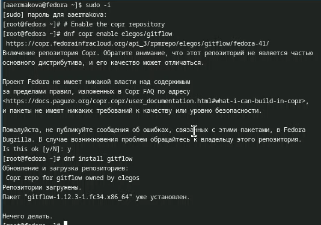

## Установка Node.js

Устанавливаем Node.js, на котором базируется программное обеспечение для семантического 
весионирования и общепринятых коммитов.

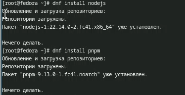

## Настройка Node.js

Для работы добавим каталог с имполняемыми файлами. Запускаю.

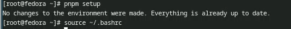 

## Общепринятые коммиты

Программа commitizen используется для помощи в форматировании коммитов.

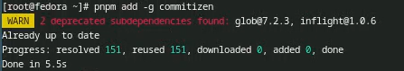

Программа standart-changelog используется для помощи в создании логов.

## Создание репозитория git

Создаю репозиторий на гитхаб.

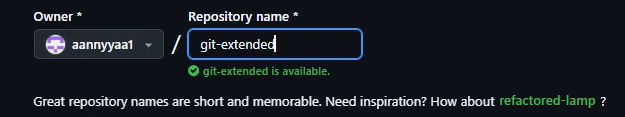

## Создание репозитория git

Конфигурация общепринятых коммитов.

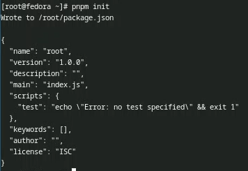

## Создание репозитория git

Заполняю несколько параметров пакета.

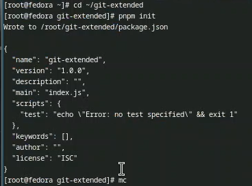

## Создание репозитория git

Захожу в mc и редактирую файл.

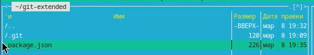

## Создание репозитория git

Получившийся файл сохраняю и выхожу.

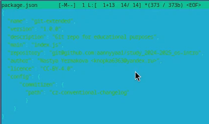

## Создание репозитория git

Добавляю новые файлы, выполняю коммит.

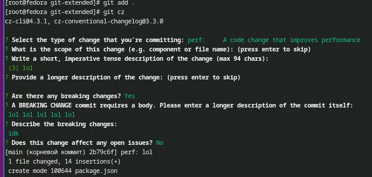

## Создание репозитория git

Отпраляю на гитхаб.

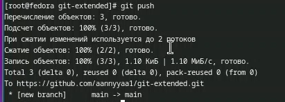

## Создание репозитория git

Инициализирую git-flow.

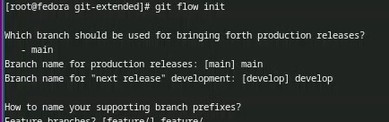

## Создание репозитория git

Проверяю, что я в ветке develop и загружаю весь репозиторий в хранилище.

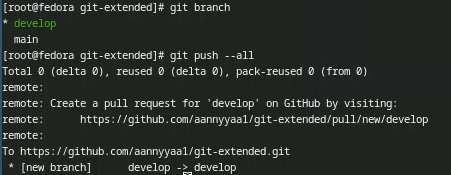

## Создание репозитория git

Устанавливаю внешнюю ветку как вышестоящую для ветки.

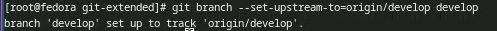

## Создание репозитория git

Создаю релиз с версией 1.0.0.

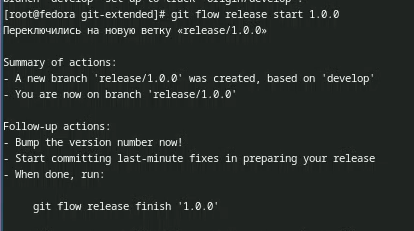

## Создание репозитория git

Создаю журнал изменений.

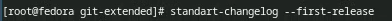

Добавляю журнал изменений в индекс.

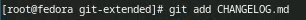

## Создание репозитория git

Заливаю релизную ветку в основную ветку.

## Создание репозитория git

Отправляю данные на гитхаб.

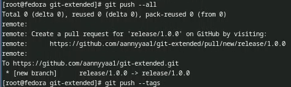

## Создание репозитория git

Создаю релиз на гитхаб.

## Работа с репозиторием git

Создаю ветку для новой функциональности.

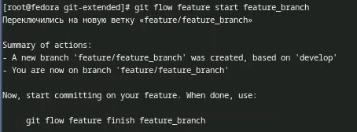

## Работа с репозиторием git

Объединяю ветку feature_branch с develop.

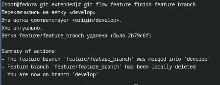

## Работа с репозиторием git

Создаю релиз с версией 1.2.3.

Создаю журнал изменений.

## Работа с репозиторием git

Добавляю журнал изменений в индекс.

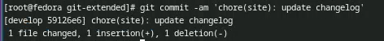

## Работа с репозиторием git

Заливаю релизную ветку в основную ветку.

## Работа с репозиторием git

Отправляю данные на гитхаб.

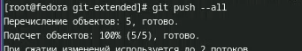

Создаю релиз на гитхаб с комментарием из журнала изменений.

# Выводы

В ходе выполнения данной лабораторной работы я получила навыки праильной работы с 
репозиториями git. 
