---
## Front matter
title: "Лабораторная работа №4"
subtitle: "Операционные системы"
author: "Ермакова Анастасия Алексеевна"

## Generic otions
lang: ru-RU
toc-title: "Содержание"

## Bibliography
bibliography: bib/cite.bib
csl: pandoc/csl/gost-r-7-0-5-2008-numeric.csl

## Pdf output format
toc: true # Table of contents
toc-depth: 2
lof: true # List of figures
lot: true # List of tables
fontsize: 12pt
linestretch: 1.5
papersize: a4
documentclass: scrreprt
## I18n polyglossia
polyglossia-lang:
  name: russian
  options:
	- spelling=modern
	- babelshorthands=true
polyglossia-otherlangs:
  name: english
## I18n babel
babel-lang: russian
babel-otherlangs: english
## Fonts
mainfont: IBM Plex Serif
romanfont: IBM Plex Serif
sansfont: IBM Plex Sans
monofont: IBM Plex Mono
mathfont: STIX Two Math
mainfontoptions: Ligatures=Common,Ligatures=TeX,Scale=0.94
romanfontoptions: Ligatures=Common,Ligatures=TeX,Scale=0.94
sansfontoptions: Ligatures=Common,Ligatures=TeX,Scale=MatchLowercase,Scale=0.94
monofontoptions: Scale=MatchLowercase,Scale=0.94,FakeStretch=0.9
mathfontoptions:
## Biblatex
biblatex: true
biblio-style: "gost-numeric"
biblatexoptions:
  - parentracker=true
  - backend=biber
  - hyperref=auto
  - language=auto
  - autolang=other*
  - citestyle=gost-numeric
## Pandoc-crossref LaTeX customization
figureTitle: "Рис."
tableTitle: "Таблица"
listingTitle: "Листинг"
lofTitle: "Список иллюстраций"
lotTitle: "Список таблиц"
lolTitle: "Листинги"
## Misc options
indent: true
header-includes:
  - \usepackage{indentfirst}
  - \usepackage{float} # keep figures where there are in the text
  - \floatplacement{figure}{H} # keep figures where there are in the text
---

# Цель работы

Получение навыков правильной работы с репозиторием git.

# Задание

- Выполнить работу для тестового репозитория
- Преобразовать рабочий репозиторий в репозиторий с git-flow и conventional commits

# Теоретическое введение

- Gitflow Workflow опубликована и популяризована Винсентом Дриссеном.
- Gitflow Workflow предполагает выстраивание строгой модели ветвления с учётом выпуска проекта.
- Данная модель отлично подходит для организации рабочего процесса на основе релизов.
- Работа по модели Gitflow включает создание отдельной ветки для исправлений ошибок в рабочей среде.

# Выполнение лабораторной работы
## Установка git-flow

Установка из коллекции репозиториев Corp (рис. [-@fig:001]).

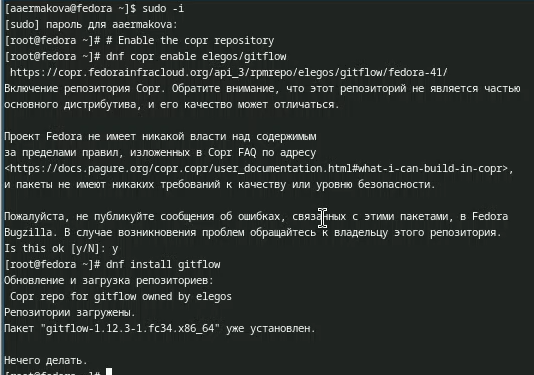{#fig:001 width=70%}

## Установка Node.js

Устанавливаем Node.js, на котором базируется программное обеспечение для семантического 
весионирования и общепринятых коммитов (рис. [-@fig:002]).

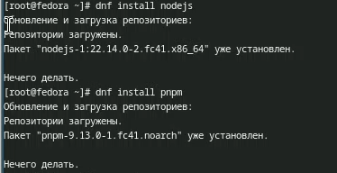{#fig:002 width=70%}

## Настройка Node.js

Для работы добавим каталог с имполняемыми файлами. Запускаю (рис. [-@fig:003]).

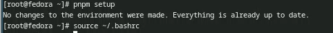{#fig:003 width=70%} 

## Общепринятые коммиты

Программа commitizen используется для помощи в форматировании коммитов (рис. [-@fig:004]).

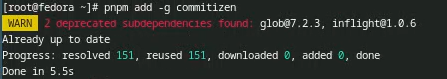{#fig:004 width=70%}

Программа standart-changelog используется для помощи в создании логов (рис. [-@fig:005]).

{#fig:005 width=70%}

## Создание репозитория git

Создаю репозиторий на гитхаб (рис. [-@fig:006]).

{#fig:006 width=70%}

Конфигурация общепринятых коммитов.(рис. [-@fig:007]).

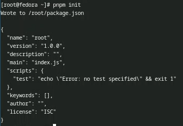{#fig:007 width=70%}

Заполняю несколько параметров пакета (рис. [-@fig:008]).

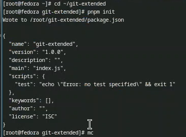{#fig:008 width=70%}

Захожу в mc и редактирую файл (рис. [-@fig:009]).

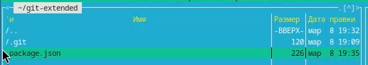{#fig:009 width=70%}

Получившийся файл сохраняю и выхожу (рис. [-@fig:010]).

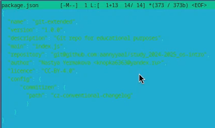{#fig:010 width=70%}

Добавляю новые файлы, выполняю коммит (рис. [-@fig:011]).

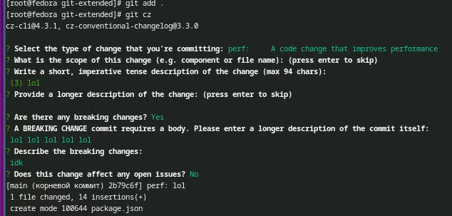{#fig:011 width=70%}

Отпраляю на гитхаб (рис. [-@fig:012]).

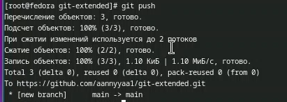{#fig:012 width=70%}

Инициализирую git-flow (рис. [-@fig:013]).

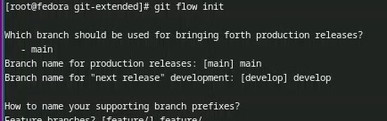{#fig:013 width=70%}

Проверяю, что я в ветке develop и загружаю весь репозиторий в хранилище (рис. [-@fig:014]).

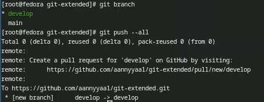{#fig:014 width=70%}

Устанавливаю внешнюю ветку как вышестоящую для ветки (рис. [-@fig:015]).

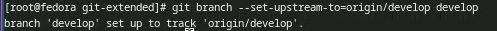{#fig:015 width=70%}

Создаю релиз с версией 1.0.0 (рис. [-@fig:016]).

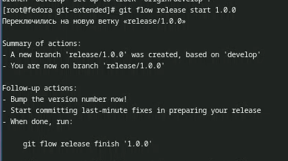{#fig:016 width=70%}

Создаю журнал изменений (рис. [-@fig:017]).

{#fig:017 width=70%}

Добавляю журнал изменений в индекс (рис. [-@fig:018]-[-@fig:019]).

{#fig:018 width=70%}

{#fig:019 width=70%}

Заливаю релизную ветку в основную ветку (рис. [-@fig:020]).

{#fig:020 width=70%}

Отправляю данные на гитхаб (рис. [-@fig:021]).

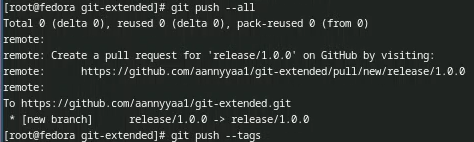{#fig:021 width=70%}

Создаю релиз на гитхаб (рис. [-@fig:022]).

{#fig:022 width=70%}

## Работа с репозиторием git

Создаю ветку для новой функциональности (рис. [-@fig:023]).

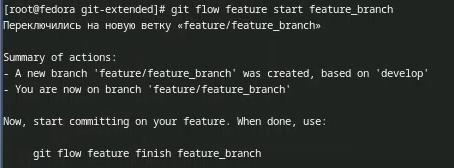{#fig:023 width=70%}

Объединяю ветку feature_branch с develop (рис. [-@fig:024]).

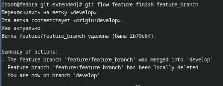{#fig:024 width=70%}

Создаю релиз с версией 1.2.3 (рис. [-@fig:025]).

{#fig:025 width=70%}

Создаю журнал изменений (рис. [-@fig:026]).

{#fig:026 width=70%}

Добавляю журнал изменений в индекс (рис. [-@fig:027]-[-@fig:028]).

{#fig:027 width=70%}

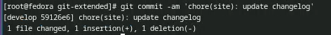{#fig:028 width=70%}

Заливаю релизную ветку в основную ветку (рис. [-@fig:029]).

{#fig:029 width=70%}

Отправляю данные на гитхаб (рис. [-@fig:030]-[-@fig:031]).

{#fig:030 width=70%}

{#fig:031 width=70%}

Создаю релиз на гитхаб с комментарием из журнала изменений (рис. [-@fig:032]).

{#fig:032 width=70%}

# Выводы

В ходе выполнения данной лабораторной работы я получила навыки праильной работы с 
репозиториями git. 

# Список литературы

::: {#refs}
:::

