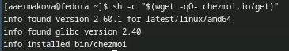

---
## Front matter
lang: ru-RU
title: Лабораторная работа №5
subtitle: Операционные системы
author:
  - Ермакова А. А.
institute:
  - Российский университет дружбы народов, Москва, Россия
date: 15 марта 2025

## i18n babel
babel-lang: russian
babel-otherlangs: english

## Formatting pdf
toc: false
toc-title: Содержание
slide_level: 2
aspectratio: 169
section-titles: true
theme: metropolis
header-includes:
 - \metroset{progressbar=frametitle,sectionpage=progressbar,numbering=fraction}
---

# Информация

## Докладчик

:::::::::::::: {.columns align=center}
::: {.column width="70%"}

  * Ермакова Анастасия Алексеевна, НКАбд-02-24
  * студентка факультета физико-математических и естественных наук
  * Российский университет дружбы народов
  * [1132246718@rudn.ru](mailto:1132246718@rudn.ru)
  * <https://aannyyaa1.github.io/ru/>

:::
::: {.column width="30%"}

:::
::::::::::::::

## Цель работы

Познакомиться с pass, gopass, native messaging, chezmoi. Научиться пользоваться этими утилитами, синхронизировать их с гит.

## Задание

1. Установить и настроить pass
2. Настроить интерфейс с браузером
3. Сохранить пароль
4. Установить и настроить chezmoi
5. Настроить chezmoi на новой машине
6. Выполнить ежедневные операции с chezmoi

## Теоретическое введение

Менеджер паролей pass — программа, сделанная в рамках идеологии Unix.
Также носит название стандартного менеджера паролей для Unix (The standard Unix password manager).

Основные свойства:
Данные хранятся в файловой системе в виде каталогов и файлов.
Файлы шифруются с помощью GPG-ключа.

Структура базы паролей:
Структура базы может быть произвольной, если Вы собираетесь использовать её напрямую, без промежуточного программного обеспечения. Тогда семантику структуры базы данных Вы держите в своей голове.
Если же необходимо использовать дополнительное программное обеспечение, необходимо семантику заложить в структуру базы паролей.

# Выполнение лабораторной работы
## Установка и настройка pass

Устанавливаю  pass.

## Установка и настройка pass

Устанавливаю gopass.

## Установка и настройка pass

Переходим к настройкам. Просматриваю список ключей.

Инициализирую хранилище.

## Установка и настройка pass

Теперь синхронизирую с git. Создам структуру git.

## Установка и настройка pass

Задаю адрес репозитория на хостинге, предварительно создав приватный репозиторий pass на GitHub.

## Установка и настройка pass

Для синхронизации выполняю следующие команды: pass git pull...

А так же pass git push.

## Установка и настройка pass

## Установка и настройка pass

Проверяю статус синхронизации следующей командой.

## Настройка интерфейса с браузером

Для начала устанавливаю плагин с браузером (фаерфокс).

## Настройка интерфейса с браузером

Интерфейс для взаимодействия с браузером (native messaging).

## Настройка интерфейса с браузером

## Сохранение пароля

Добавляю новый пароль.

## Сохранение пароля

Отображаю пароль для указанного файла, предварительно перехожу в нужный каталог.

## Сохранение пароля

Заменяю существующий пароль.

## Установка и настройка chezmoi. Управление файлами конфигурации

Устанавливаю дополнительное программное обеспечение.

## Установка и настройка chezmoi. Управление файлами конфигурации

Устанавливаю шрифты.

## Установка и настройка chezmoi. Управление файлами конфигурации

## Установка и настройка chezmoi. Управление файлами конфигурации

## Установка и настройка chezmoi. Управление файлами конфигурации

Устанавливаю бинарный файл. Скрипт определяет архитектуру процессора и операционную систему и скачивает необходимый файл:

## Установка и настройка chezmoi. Управление файлами конфигурации

Буду использовать утилиты командной строки для работы с github. Для начала залогинюсь на гитхаб.

## Установка и настройка chezmoi. Управление файлами конфигурации

Создам свой репозиторий для конфигурационных файлов на основе шаблона.

## Установка и настройка chezmoi. Управление файлами конфигурации

Инициализирую chezmoi с моим репозиторием dotfiles.

## Установка и настройка chezmoi. Управление файлами конфигурации

Проверяю, какие изменения внесёт chezmoi в домашний каталог, запускаю.

Меня устраивают изменения, поэтому запускаю следующую команду.

## Настройка chezmoi на новой машине

Перехожу на другую виртуальную машиу, открываю терминал, устанавливаю бинарный файл и инициализирую chezmoi с моим репозиторием dotfiles.

## Настройка chezmoi на новой машине

Проверяю, какие изменения внесёт chezmoi в домашний каталог, запускаю chezmoi diff, и принимаю изменения.

## Настройка chezmoi на новой машине

При существующем каталоге chezmoi можно получить и применить последние изменения из моего репозитория.

## Настройка chezmoi на новой машине

Устанавливаю мои dotfiles на новый компьютер с помощью одной команды.

## Ежедневные операции с chezmoi

Извлекаю последние изменения из репозитория и применяю их с помощью одной команды.

# Выводы

В ходе выполнения данной лабораторной работы я научилась устанавливать, настраивать и пользоваться основными возможностями менеджера паролей.

