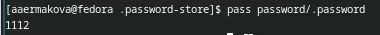
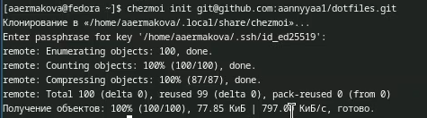

---
## Front matter
title: "Отчет по лабораторной работе №5"
subtitle: "Операционные системы"
author: "Ермакова Анастасия Алексеевна"

## Generic otions
lang: ru-RU
toc-title: "Содержание"

## Bibliography
bibliography: bib/cite.bib
csl: pandoc/csl/gost-r-7-0-5-2008-numeric.csl

## Pdf output format
toc: true # Table of contents
toc-depth: 2
lof: true # List of figures
lot: true # List of tables
fontsize: 12pt
linestretch: 1.5
papersize: a4
documentclass: scrreprt
## I18n polyglossia
polyglossia-lang:
  name: russian
  options:
	- spelling=modern
	- babelshorthands=true
polyglossia-otherlangs:
  name: english
## I18n babel
babel-lang: russian
babel-otherlangs: english
## Fonts
mainfont: IBM Plex Serif
romanfont: IBM Plex Serif
sansfont: IBM Plex Sans
monofont: IBM Plex Mono
mathfont: STIX Two Math
mainfontoptions: Ligatures=Common,Ligatures=TeX,Scale=0.94
romanfontoptions: Ligatures=Common,Ligatures=TeX,Scale=0.94
sansfontoptions: Ligatures=Common,Ligatures=TeX,Scale=MatchLowercase,Scale=0.94
monofontoptions: Scale=MatchLowercase,Scale=0.94,FakeStretch=0.9
mathfontoptions:
## Biblatex
biblatex: true
biblio-style: "gost-numeric"
biblatexoptions:
  - parentracker=true
  - backend=biber
  - hyperref=auto
  - language=auto
  - autolang=other*
  - citestyle=gost-numeric
## Pandoc-crossref LaTeX customization
figureTitle: "Рис."
tableTitle: "Таблица"
listingTitle: "Листинг"
lofTitle: "Список иллюстраций"
lotTitle: "Список таблиц"
lolTitle: "Листинги"
## Misc options
indent: true
header-includes:
  - \usepackage{indentfirst}
  - \usepackage{float} # keep figures where there are in the text
  - \floatplacement{figure}{H} # keep figures where there are in the text
---

# Цель работы

Познакомиться с pass, gopass, native messaging, chezmoi. Научиться пользоваться этими утилитами, синхронизировать их с гит.

# Задание

1. Установить и настроить pass
2. Настроить интерфейс с браузером
3. Сохранить пароль
4. Установить и настроить chezmoi
5. Настроить chezmoi на новой машине
6. Выполнить ежедневные операции с chezmoi

# Теоретическое введение

Менеджер паролей pass — программа, сделанная в рамках идеологии Unix.
Также носит название стандартного менеджера паролей для Unix (The standard Unix password manager).

Основные свойства:
Данные хранятся в файловой системе в виде каталогов и файлов.
Файлы шифруются с помощью GPG-ключа.

Структура базы паролей:
Структура базы может быть произвольной, если Вы собираетесь использовать её напрямую, без промежуточного программного обеспечения. Тогда семантику структуры базы данных Вы держите в своей голове.
Если же необходимо использовать дополнительное программное обеспечение, необходимо семантику заложить в структуру базы паролей.

# Выполнение лабораторной работы
## Установка и настройка pass

Устанавливаю  pass (рис. [-@fig:001]).

{#fig:001 width=70%}

Устанавливаю gopass (рис. [-@fig:002]).

{#fig:002 width=70%}

Переходим к настройкам. Просматриваю список ключей (рис. [-@fig:003]).

{#fig:003 width=70%}

Инициализирую хранилище (рис. [-@fig:004]).

{#fig:004 width=70%}

Теперь синхронизирую с git. Создам структуру git (рис. [-@fig:005]).

{#fig:005 width=70%}

Задаю адрес репозитория на хостинге, предварительно создав приватный репозиторий pass на GitHub (рис. [-@fig:006]).

{#fig:006 width=70%}

Для синхронизации выполняю следующие команды: pass git pull... (рис. [-@fig:007]).

{#fig:007 width=70%}

А так же pass git push (рис. [-@fig:008]).

{#fig:008 width=70%}

Проверяю статус синхронизации следующей командой (рис. [-@fig:009]).

{#fig:009 width=70%}

## Настройка интерфейса с браузером

Для начала устанавливаю плагин с браузером (фаерфокс) (рис. [-@fig:010]).

{#fig:010 width=70%}

Интерфейс для взаимодействия с браузером (native messaging) (рис. [-@fig:011] - рис. [-@fig:012]).

{#fig:011 width=70%}

{#fig:012 width=70%}

## Сохранение пароля

Добавляю новый пароль (рис. [-@fig:013]).

{#fig:013 width=70%}

Отображаю пароль для указанного файла, предварительно перехожу в нужный каталог (рис. [-@fig:014]).

{#fig:014 width=70%}

Заменяю существующий пароль (рис. [-@fig:015]).

{#fig:015 width=70%}

## Установка и настройка chezmoi. Управление файлами конфигурации

Устанавливаю дополнительное программное обеспечение (рис. [-@fig:016]).

{#fig:016 width=70%}

Устанавливаю шрифты (рис. [-@fig:017] - рис. [-@fig:019]).

{#fig:017 width=70%}

{#fig:018 width=70%}

{#fig:019 width=70%}

Устанавливаю бинарный файл. Скрипт определяет архитектуру процессора и операционную систему и скачивает необходимый файл:(рис. [-@fig:020]).

{#fig:020 width=70%}

Буду использовать утилиты командной строки для работы с github. Для начала залогинюсь на гитхаб (рис. [-@fig:021]).

{#fig:021 width=70%}

Создам свой репозиторий для конфигурационных файлов на основе шаблона. (рис. [-@fig:022]).

{#fig:022 width=70%}

Инициализирую chezmoi с моим репозиторием dotfiles (рис. [-@fig:023]).

{#fig:023 width=70%}

Проверяю, какие изменения внесёт chezmoi в домашний каталог, запускаю (рис. [-@fig:024]).

{#fig:024 width=70%}

Меня устраивают изменения, поэтому запускаю следующую команду (рис. [-@fig:025]).

{#fig:025 width=70%}

## Настройка chezmoi на новой машине

Перехожу на другую виртуальную машиу, открываю терминал, устанавливаю бинарный файл и инициализирую chezmoi с моим репозиторием dotfiles (рис. [-@fig:026]).

{#fig:026 width=70%}

Проверяю, какие изменения внесёт chezmoi в домашний каталог, запускаю chezmoi diff, и принимаю изменения (рис. [-@fig:027]).

{#fig:027 width=70%}

При существующем каталоге chezmoi можно получить и применить последние изменения из моего репозитория (рис. [-@fig:028]).

{#fig:028 width=70%}

Устанавливаю мои dotfiles на новый компьютер с помощью одной команды (рис. [-@fig:029]).

{#fig:029 width=70%}

## Ежедневные операции с chezmoi

Извлекаю последние изменения из репозитория и применяю их с помощью одной команды(рис. [-@fig:030]).

{#fig:030 width=70%}

# Выводы

В ходе выполнения данной лабораторной работы я научилась устанавливать, настраивать и пользоваться основными возможностями менеджера паролей.

# Список литературы

::: 

