---
## Front matter
lang: ru-RU
title: Лабораторная работа №6
subtitle: Операционные системы
author:
  - Ермакова А. А.
institute:
  - Российский университет дружбы народов, Москва, Россия
date: 20 марта 2025

## i18n babel
babel-lang: russian
babel-otherlangs: english

## Formatting pdf
toc: false
toc-title: Содержание
slide_level: 2
aspectratio: 169
section-titles: true
theme: metropolis
header-includes:
 - \metroset{progressbar=frametitle,sectionpage=progressbar,numbering=fraction}
---

# Информация

## Докладчик

:::::::::::::: {.columns align=center}
::: {.column width="70%"}

  * Ермакова Анастасия Алексеевна, НКАбд-02-24
  * студентка факультета физико-математических и естественных наук
  * Российский университет дружбы народов
  * [1132246718@rudn.ru](mailto:1132246718@rudn.ru)
  * <https://aannyyaa1.github.io/ru/>

:::
::: {.column width="30%"}

:::
::::::::::::::

## Цель работы

Приобрести практические навыки взаимодействия пользователя с системой посредством командной строки.

## Задание 

1. Определить полное имя домашнего каталога.
2. Выполнить следующие действия:
- Перейти в каталог /tmp.
- Вывести на экран содержимое каталога /tmp. 
- Определить, есть ли в каталоге /var/spool подкаталог с именем cron.
- Перейти в домашний каталог и вывести на экран его содержимое. 
3. Выполнить следующие действия:
- В домашнем каталоге создать новый каталог с именем newdir.
- В каталоге ~/newdir создать новый каталог с именем morefun.
- В домашнем каталоге создать одной командой три новых каталога с именами
letters, memos, misk. Затем удалить эти каталоги одной командой.
- Попробовать удалить ранее созданный каталог ~/newdir командой rm. Проверить,
был ли каталог удалён.
- Удалить каталог ~/newdir/morefun из домашнего каталога. Проверить, был ли
каталог удалён.
4. С помощью команды man определить, какую опцию команды ls нужно использо-
вать для просмотра содержимое не только указанного каталога, но и подкаталогов,
входящих в него.
5. С помощью команды man определить набор опций команды ls, позволяющий отсорти-
ровать по времени последнего изменения выводимый список содержимого каталога
с развёрнутым описанием файлов.
6. Использовать команду man для просмотра описания следующих команд: cd, pwd, mkdir,
rmdir, rm. Пояснить основные опции этих команд.
7. Используя информацию, полученную при помощи команды history, выполнить мо-
дификацию и исполнение нескольких команд из буфера команд.

## Теоретическое введение

В операционной системе типа Linux взаимодействие пользователя с системой обычно
осуществляется с помощью командной строки посредством построчного ввода команд. 
При этом обычно используется командные интерпретаторы языка shell: /bin/sh; /bin/csh; /bin/ksh.
Формат команды. 
Командой в операционной системе называется записанный по
специальным правилам текст (возможно с аргументами), представляющий собой указание 
на выполнение какой-либо функций (или действий) в операционной системе.
Обычно первым словом идёт имя команды, остальной текст — аргументы или опции,
конкретизирующие действие.
Общий формат команд можно представить следующим образом:
<имя_команды><разделитель><аргументы>
Команда man. 
Команда man используется для просмотра (оперативная помощь) в диалоговом 
режиме руководства (manual) по основным командам операционной системы типа Linux.
Формат команды:
man <команда>
Для управления просмотром результата выполнения команды man можно использовать
следующие клавиши:
– Space — перемещение по документу на одну страницу вперёд;
– Enter — перемещение по документу на одну строку вперёд;
– q — выход из режима просмотра описания.

# Выполнение лабораторной работы
## Полное имя домашнего каталога

Определяю полное имя моего домашнего каталога.

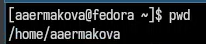

## Использование ls

Перехожу в каталог tmp. Вывожу на экран его содержимое с помощью утилиты ls без ключей.

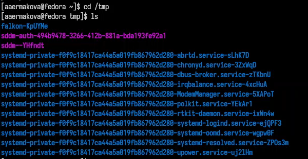

## Использование ls

Использую ls с опцией -l, которая позволяет увидеть дополнительную информацию о файлах в каталоге: дата создания, владельца, права.

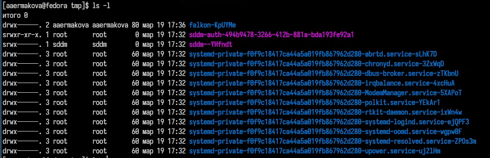

## Использование ls

ИСпользую эту команду с опцией -а, которая показывает скрытые файлы в каталоге.

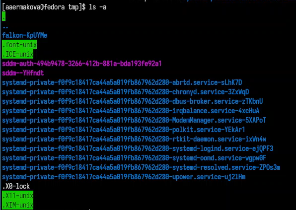

## Использование ls

С помощью утилиты cd перехожу в каталог var/spool. С помощью утилиты ls с опцией -F смотрю, какие подкаталоги здесь содержатся. 
Действительно, подкаталог cron/ найден.

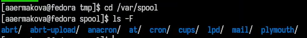

## Использование ls

Далее возвращаюсь в домашний каталог с помощью команды cd. Проверяю содержимое каталога спомощью утилиты ls. Опция -l 
позволяет определить владельцев файлов, опция -a показывает все содержимое каталога, а опция -F поможет определить, что из содержимого 
файл, а что каталог.

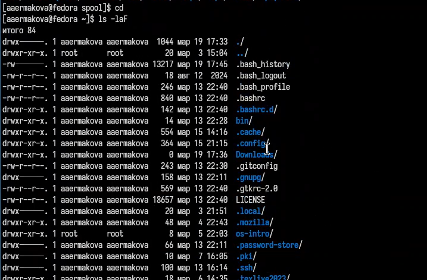

## Создание каталогов

С помощью функции mkdir создаю новый каталог newdir. Проверяю.

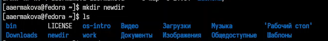

## Создание каталогов

Перехожу в созданный каталог и оттуда создаю подкаталог morefun. Проверяю.

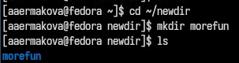

## Создание каталогов

Одной командой создаю три новых каталога letters, memos, misk. Проверяю.

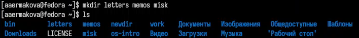

## Удаление каталогов

Затем удаляю их одной командой. Проверяю. Все верно.

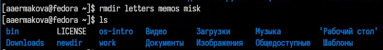

## Удаление каталогов

Пытаюсь удалить newdir с помощью rm. Эта утилита по умолчанию удаляет файлы, чтобы она удалила пустую директорию, нудно добавить опцию -d, 
а чтобы удалить не пустую директорию, добавить -r. Мы использовали ее без опций, так что ничего не удалилось.

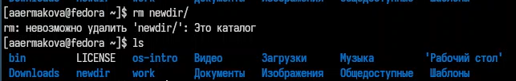

## Удаление каталогов

Удаляю каталог newdir с помощью утилиты rmdir, добавляю опцию -p для рекурсива, чтобы удалить каталог со всеми подкаталогами.

## ls

С помощью команды man ls могу прочитать документацию к команде ls, надо найти опцию, которая позволит выводить все подкаталоги каталогов.

## ls

Это опция -R.

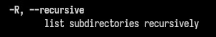

## ls

Вывожу на экран только те опции, в описании которых есть слово sort, т.к. нужно найти именно опцию сортировки. Это оказалась опция -lt.

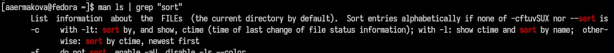

## cd

Далее, с помощью man cd узнаю описание команды и ее опции. Основные: 
1. -P позволяет следовать по символическим ссылкам перед тем, как обработаны все переходы; 
2. -L переходит по символическим ссылкам только после того, как обработаны все переходы; 
3. -e позволяет выйти с ошибкой, если директория, в которую нужно перейти, не найдена.

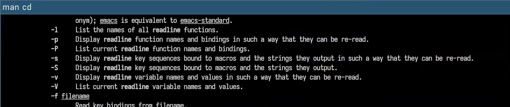

## pwd

С помощью man pwd узнаю описание команды и ее опции. Основные: 
1. -L брать директорию из переменной окружения, даже если она содержит 
символические ссылки; 
2. -P отбрасывает все символические ссылки.

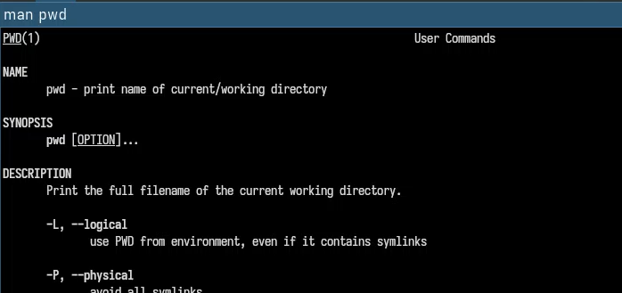

## mkdir

С помощью man mkdir узнаю описание команды mkdir и ее опции. Основные:
1. -m - устанавливает права доступа создаваемой директории как chmod, синтаксис тоже как у chmod;
2. -p - позволяет рекурсивно создавать директории и их подкаталоги;
3. -v - выводи сообщение о созданных директориях;
4. -z - установить контекст SELinux для создаваемой директории по умолчанию;
5. -context - установить контекст SELinux для создаваемой директории в значении CTX.

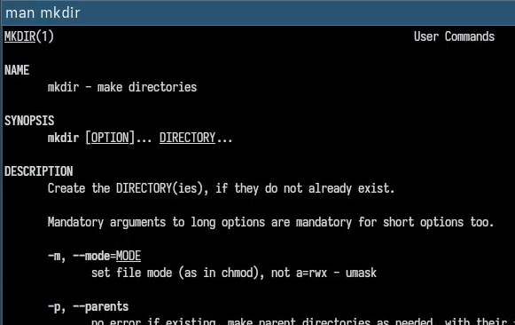

## rmdir

С помощью man rmdir узнаю описание команды rmdir и ее опции.
1. --ignore-fail-on-non-empty - отменяет вывод ошибки, если каталог не пустой, просто его игнорирует;
2. -p - удаляет рекурсивно каталоги, если они все содержат в себе только удаляемый каталог;
3. -v - выводит сообщение о каждом удалении директории.

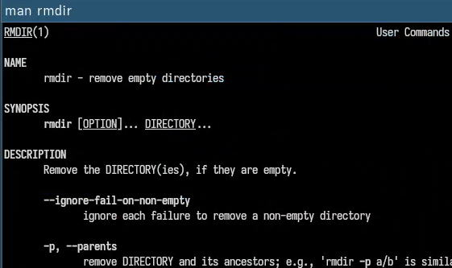

## rm

С помощью man rm узнаю описание команды rm и ее опции.
1. -f - игнорировать несуществующие файлы или аргументы, никогда не выводить запрос на подтверждение удаления;
2. -i - выводить запрос на подтверждение удаления каждого файла;
3. -I - вывести запрос на подтверждение удаления один раз, для всех файлов, если удаляется больше 3-х файлов или идет рекурсивное удаление;
4. --interactive - заменяет предыдущие три опции, можно выбрать одну из них;
5. --one-file-system - во время рекурсивного удаления пропускать директории из других файловых систем;
6. --no-preserve-root если в качестве директории задана корневая, то считать что это обычная директория и начать удаление;
7. -r, -R - удаляет директории их содержимое рекурсивно;
8. -d, --dir - удаляет пустые директории;
9. -v - прописывает все действия команды.

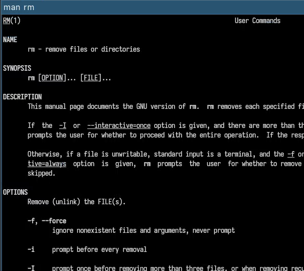

## history

Вывела историю команд с помощью утилиты history.

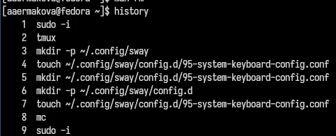

## Модифицирование команд

Модифицировала команду.

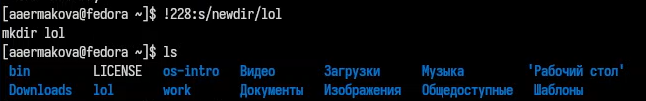

## Модифицирование команд

Модифицировала команду.

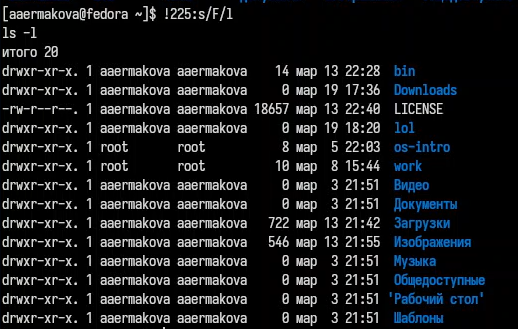

# Выводы

В ходе выполнения данной лабораторной работы я приобрела практические навыки взаимодействия пользователя с системой 
посредством командной строки.

