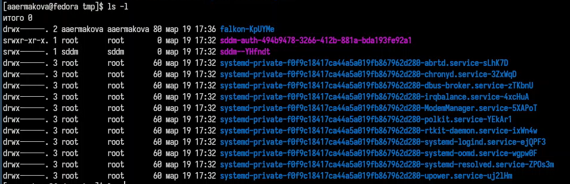
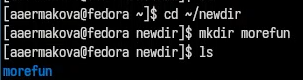

---
## Front matter
title: "Отчет по лабораторной работе №6"
subtitle: "Операционные системы"
author: "Ермакова Анастасия Алексеевна"

## Generic otions
lang: ru-RU
toc-title: "Содержание"

## Bibliography
bibliography: bib/cite.bib
csl: pandoc/csl/gost-r-7-0-5-2008-numeric.csl

## Pdf output format
toc: true # Table of contents
toc-depth: 2
lof: true # List of figures
lot: true # List of tables
fontsize: 12pt
linestretch: 1.5
papersize: a4
documentclass: scrreprt
## I18n polyglossia
polyglossia-lang:
  name: russian
  options:
	- spelling=modern
	- babelshorthands=true
polyglossia-otherlangs:
  name: english
## I18n babel
babel-lang: russian
babel-otherlangs: english
## Fonts
mainfont: IBM Plex Serif
romanfont: IBM Plex Serif
sansfont: IBM Plex Sans
monofont: IBM Plex Mono
mathfont: STIX Two Math
mainfontoptions: Ligatures=Common,Ligatures=TeX,Scale=0.94
romanfontoptions: Ligatures=Common,Ligatures=TeX,Scale=0.94
sansfontoptions: Ligatures=Common,Ligatures=TeX,Scale=MatchLowercase,Scale=0.94
monofontoptions: Scale=MatchLowercase,Scale=0.94,FakeStretch=0.9
mathfontoptions:
## Biblatex
biblatex: true
biblio-style: "gost-numeric"
biblatexoptions:
  - parentracker=true
  - backend=biber
  - hyperref=auto
  - language=auto
  - autolang=other*
  - citestyle=gost-numeric
## Pandoc-crossref LaTeX customization
figureTitle: "Рис."
tableTitle: "Таблица"
listingTitle: "Листинг"
lofTitle: "Список иллюстраций"
lotTitle: "Список таблиц"
lolTitle: "Листинги"
## Misc options
indent: true
header-includes:
  - \usepackage{indentfirst}
  - \usepackage{float} # keep figures where there are in the text
  - \floatplacement{figure}{H} # keep figures where there are in the text
---

# Цель работы

Приобрести практические навыки взаимодействия пользователя с системой посредством командной строки.

# Задание

1. Определить полное имя домашнего каталога.
2. Выполнить следующие действия:
- Перейти в каталог /tmp.
- Вывести на экран содержимое каталога /tmp. 
- Определить, есть ли в каталоге /var/spool подкаталог с именем cron.
- Перейти в домашний каталог и вывести на экран его содержимое. 
3. Выполнить следующие действия:
- В домашнем каталоге создать новый каталог с именем newdir.
- В каталоге ~/newdir создать новый каталог с именем morefun.
- В домашнем каталоге создать одной командой три новых каталога с именами
letters, memos, misk. Затем удалить эти каталоги одной командой.
- Попробовать удалить ранее созданный каталог ~/newdir командой rm. Проверить,
был ли каталог удалён.
- Удалить каталог ~/newdir/morefun из домашнего каталога. Проверить, был ли
каталог удалён.
4. С помощью команды man определить, какую опцию команды ls нужно использо-
вать для просмотра содержимое не только указанного каталога, но и подкаталогов,
входящих в него.
5. С помощью команды man определить набор опций команды ls, позволяющий отсорти-
ровать по времени последнего изменения выводимый список содержимого каталога
с развёрнутым описанием файлов.
6. Использовать команду man для просмотра описания следующих команд: cd, pwd, mkdir,
rmdir, rm. Пояснить основные опции этих команд.
7. Используя информацию, полученную при помощи команды history, выполнить мо-
дификацию и исполнение нескольких команд из буфера команд.

# Теоретическое введение

В операционной системе типа Linux взаимодействие пользователя с системой обычно
осуществляется с помощью командной строки посредством построчного ввода команд. 
При этом обычно используется командные интерпретаторы языка shell: /bin/sh; /bin/csh; /bin/ksh.
Формат команды. 
Командой в операционной системе называется записанный по
специальным правилам текст (возможно с аргументами), представляющий собой указание 
на выполнение какой-либо функций (или действий) в операционной системе.
Обычно первым словом идёт имя команды, остальной текст — аргументы или опции,
конкретизирующие действие.
Общий формат команд можно представить следующим образом:
<имя_команды><разделитель><аргументы>
Команда man. 
Команда man используется для просмотра (оперативная помощь) в диалоговом 
режиме руководства (manual) по основным командам операционной системы типа Linux.
Формат команды:
man <команда>
Для управления просмотром результата выполнения команды man можно использовать
следующие клавиши:
– Space — перемещение по документу на одну страницу вперёд;
– Enter — перемещение по документу на одну строку вперёд;
– q — выход из режима просмотра описания.

# Выполнение лабораторной работы

Определяю полное имя моего домашнего каталога (рис. [-@fig:001]).

{#fig:001 width=70%}

Перехожу в каталог tmp. Вывожу на экран его содержимое с помощью утилиты ls без ключей (рис. [-@fig:002]).

{#fig:002 width=70%}

Использую ls с опцией -l, которая позволяет увидеть дополнительную информацию о файлах в каталоге: дата создания, владельца, права (рис. [-@fig:003]).

{#fig:003 width=70%}

ИСпользую эту команду с опцией -а, которая показывает скрытые файлы в каталоге (рис. [-@fig:004]).

{#fig:004 width=70%}

С помощью утилиты cd перехожу в каталог var/spool. С помощью утилиты ls с опцией -F смотрю, какие подкаталоги здесь содержатся. 
Действительно, подкаталог cron/ найден (рис. [-@fig:005]).

{#fig:005 width=70%}

Далее возвращаюсь в домашний каталог с помощью команды cd. Проверяю содержимое каталога спомощью утилиты ls. Опция -l 
позволяет определить владельцев файлов, опция -a показывает все содержимое каталога, а опция -F поможет определить, что из содержимого 
файл, а что каталог. (рис. [-@fig:006]).

{#fig:006 width=70%}

С помощью функции mkdir создаю новый каталог newdir. Проверяю (рис. [-@fig:007]).

{#fig:007 width=70%}

Перехожу в созданный каталог и оттуда создаю подкаталог morefun. Проверяю (рис. [-@fig:008]).

{#fig:008 width=70%}

Одной командой создаю три новых каталога letters, memos, misk. Проверяю (рис. [-@fig:009]).

{#fig:009 width=70%}

Затем удаляю их одной командой. Проверяю. Все верно (рис. [-@fig:010]).

{#fig:010 width=70%}

Пытаюсь удалить newdir с помощью rm. Эта утилита по умолчанию удаляет файлы, чтобы она удалила пустую директорию, нудно добавить опцию -d, 
а чтобы удалить не пустую директорию, добавить -r. Мы использовали ее без опций, так что ничего не удалилось (рис. [-@fig:011]).

{#fig:011 width=70%}

Удаляю каталог newdir с помощью утилиты rmdir, добавляю опцию -p для рекурсива, чтобы удалить каталог со всеми подкаталогами (рис. [-@fig:012]).

{#fig:012 width=70%}

С помощью команды man ls могу прочитать документацию к команде ls, надо найти опцию, которая позволит выводить все подкаталоги каталогов (рис. [-@fig:013]).

{#fig:013 width=70%}

Это опция -R (рис. [-@fig:014]).

{#fig:014 width=70%}

Вывожу на экран только те опции, в описании которых есть слово sort, т.к. нужно найти именно опцию сортировки. Это оказалась опция -lt (рис. [-@fig:015]).

{#fig:015 width=70%}

Далее, с помощью man cd узнаю описание команды и ее опции (рис. [-@fig:016]). Основные: 
1. -P позволяет следовать по символическим ссылкам перед тем, как обработаны все переходы; 
2. -L переходит по символическим ссылкам только после того, как обработаны все переходы; 
3. -e позволяет выйти с ошибкой, если директория, в которую нужно перейти, не найдена.

{#fig:016 width=70%}

С помощью man pwd узнаю описание команды и ее опции (рис. [-@fig:017]). Основные: 
1. -L брать директорию из переменной окружения, даже если она содержит 
символические ссылки; 
2. -P отбрасывает все символические ссылки.

{#fig:017 width=70%}

С помощью man mkdir узнаю описание команды mkdir и ее опции (рис. [-@fig:018]). Основные:
1. -m - устанавливает права доступа создаваемой директории как chmod, синтаксис тоже как у chmod;
2. -p - позволяет рекурсивно создавать директории и их подкаталоги;
3. -v - выводи сообщение о созданных директориях;
4. -z - установить контекст SELinux для создаваемой директории по умолчанию;
5. -context - установить контекст SELinux для создаваемой директории в значении CTX.

{#fig:018 width=70%}

С помощью man rmdir узнаю описание команды rmdir и ее опции (рис. [-@fig:019]).
1. --ignore-fail-on-non-empty - отменяет вывод ошибки, если каталог не пустой, просто его игнорирует;
2. -p - удаляет рекурсивно каталоги, если они все содержат в себе только удаляемый каталог;
3. -v - выводит сообщение о каждом удалении директории.

{#fig:019 width=70%}

С помощью man rm узнаю описание команды rm и ее опции (рис. @fig:020).
1. -f - игнорировать несуществующие файлы или аргументы, никогда не выводить запрос на подтверждение удаления;
2. -i - выводить запрос на подтверждение удаления каждого файла;
3. -I - вывести запрос на подтверждение удаления один раз, для всех файлов, если удаляется больше 3-х файлов или идет рекурсивное удаление;
4. --interactive - заменяет предыдущие три опции, можно выбрать одну из них;
5. --one-file-system - во время рекурсивного удаления пропускать директории из других файловых систем;
6. --no-preserve-root если в качестве директории задана корневая, то считать что это обычная директория и начать удаление;
7. -r, -R - удаляет директории их содержимое рекурсивно;
8. -d, --dir - удаляет пустые директории;
9. -v - прописывает все действия команды.

{#fig:020 width=70%}

Вывела историю команд с помощью утилиты history (рис. [-@fig:021]).

{#fig:021 width=70%}

Модифицировала команду (рис. [-@fig:022]).

{#fig:022 width=70%}

Модифицировала команду (рис. [-@fig:023]).

{#fig:023 width=70%}

# Выводы

В ходе выполнения данной лабораторной работы я приобрела практические навыки взаимодействия пользователя с системой 
посредством командной строки.

# Список литературы

::: {#refs}
:::
