---
## Front matter
lang: ru-RU
title: Лабораторная работа №7
subtitle: Операционные системы
author:
  - Ермакова А. А.
institute:
  - Российский университет дружбы народов, Москва, Россия
date: 29 марта 2025

## i18n babel
babel-lang: russian
babel-otherlangs: english

## Formatting pdf
toc: false
toc-title: Содержание
slide_level: 2
aspectratio: 169
section-titles: true
theme: metropolis
header-includes:
 - \metroset{progressbar=frametitle,sectionpage=progressbar,numbering=fraction}
---

# Информация

## Докладчик

:::::::::::::: {.columns align=center}
::: {.column width="70%"}

  * Ермакова Анастасия Алексеевна, НКАбд-02-24
  * студентка факультета физико-математических и естественных наук
  * Российский университет дружбы народов
  * [1132246718@rudn.ru](mailto:1132246718@rudn.ru)
  * <https://aannyyaa1.github.io/ru/>

:::
::: {.column width="30%"}

:::
::::::::::::::

## Цель работы

Целью данной лабораторной работы является ознакомление с файловой системой Linux, её структурой, именами и содержанием к
аталогов. Приобретение практических навыков по применению команд для работы с файлами и каталогами, по управлению процессами 
(и работами), по проверке использования диска и обслуживанию файловой системы.

## Задание

1. Выполнить все примеры из лабораторной работы
2. Выполнить команды по копированию, созданию и перемещению файлов и каталогов
3. Определить опции команды chmod
4. Изменить права доступа к файлам
5. Прочитать документацию о командах mount, fsck, mkfs, kill

## Теоретическое введение

Для создания текстового файла можно использовать команду touch. Для просмотра файлов небольшого размера можно использовать команду cat. Для просмотра файлов постранично удобнее использовать команду less. Команда cp используется для копирования файлов и каталогов. Команды mv и mvdir предназначены для перемещения и переименования файлов и каталогов.

Каждый файл или каталог имеет права доступа. В сведениях о файле или каталоге указываются:

– тип файла (символ (-) обозначает файл, а символ (d) — каталог);

– права для владельца файла (r — разрешено чтение, w — разрешена запись, x — разрешено выполнение, - — право доступа отсутствует);

– права для членов группы (r — разрешено чтение, w — разрешена запись, x — разрешено выполнение, - — право доступа отсутствует);

– права для всех остальных (r — разрешено чтение, w — разрешена запись, x — разрешено выполнение, - — право доступа отсутствует).

Права доступа к файлу или каталогу можно изменить, воспользовавшись командой chmod. Сделать это может владелец файла (или каталога) или пользователь с правами администратора.

Файловая система в Linux состоит из фалов и каталогов. Каждому физическому носителю соответствует своя файловая система. Существует несколько типов файловых систем. Перечислим наиболее часто встречающиеся типы:

– ext2fs (second extended filesystem);

– ext2fs (third extended file system);

– ext4 (fourth extended file system);

– ReiserFS;

– xfs;

– fat (file allocation table);

– ntfs (new technology file system).

Для просмотра используемых в операционной системе файловых систем можно вос- пользоваться командой mount без параметров.

# Выполнение лабораторной работы
## Выполнение всех примеров из лабораторной работы

Выполняю все примеры, приведенные в первой части описания лабораторной работы.

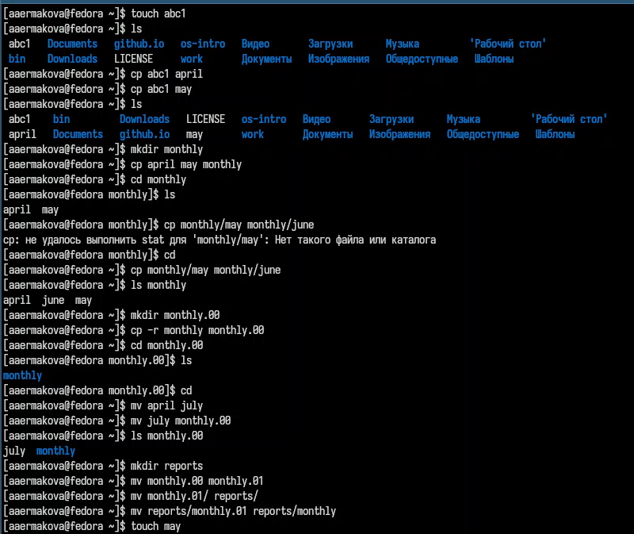

## Выполнение всех примеров из лабораторной работы

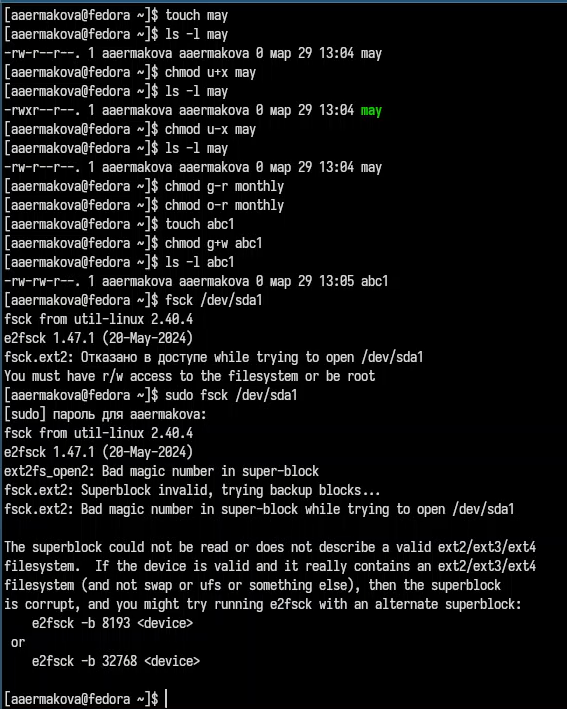

## Выполнение команды по копированию, созданию и перемещению файлов и каталогов

Копирую файл в домашний каталог с новым именем, создаю новую пустую директорию, перемещаю файл в эту директорию, 
переименовываю файл.

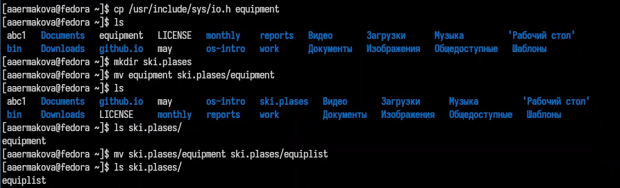

## Выполнение команды по копированию, созданию и перемещению файлов и каталогов

Создаю новый файл, копирую его в новую директорию, но уже сразу с новым именем. Создаю внутри этого каталога подкаталог, 
перемещаю файлы в подкаталог.

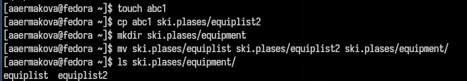

## Выполнение команды по копированию, созданию и перемещению файлов и каталогов

Создаю новую директорию, в этой же строчке перемещаю ее с новым именем в директорию, созданную в прошлый раз.

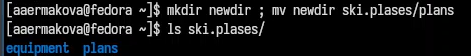

## Определение опции команды chmod. Изменение прав доступа к файлам

Проверяю, какие права нужно поменять и как, чтобу у новой директория были нужные по заданию права.

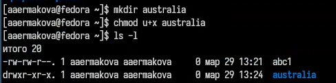

## Определение опции команды chmod. Изменение прав доступа к файлам

Проверяю, какие права нужно поменять и как, чтобу у новых файлов были нужные по заданию права.

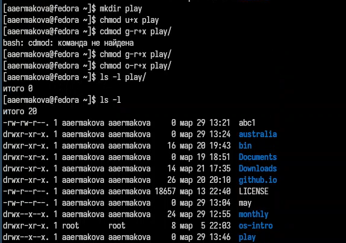

## Определение опции команды chmod. Изменение прав доступа к файлам

Создаю файл, добавляю в правах доступа право но исполнение и убираю право на запись для владельца, затем создаю следующий файл, ему в правах доступа добавляю право на запись для группы.

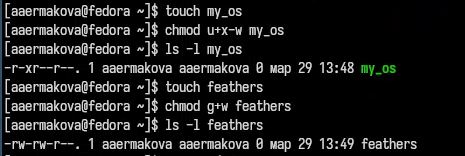

## Определение опции команды chmod. Изменение прав доступа к файлам

Читаю содержимое файла.

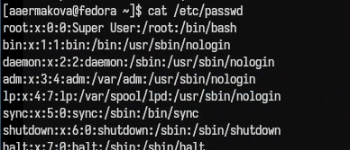

## Определение опции команды chmod. Изменение прав доступа к файлам

Копирую файл с новым именем, перемещаю его в ранее созданную директорию, рекурсивно ее копирую с новым именем, рекурсивно копирую в нее скопированную до этого папку.

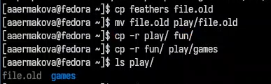

## Определение опции команды chmod. Изменение прав доступа к файлам

Убираю право на чтение у файла для создателя, поэтому не могу его прочесть, также не могу его скопировать, потому что отказано в доступе на чтение, возвращаю все права.

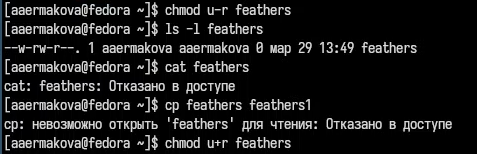

## Определение опции команды chmod. Изменение прав доступа к файлам

Убираю у директории право на исполнение для пользователя, пытаюсь в нее войти - отказано в доступе, возвращаю все права.

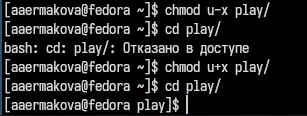

## Чтение документации о командах mount, fsck, mkfs, kill

Я прочитала описание каждой из четырех команд с помощью man.

mount — утилита командной строки в UNIX-подобных операционных системах. Применяется для монтирования файловых систем.
fsck (проверка файловой системы) - это утилита командной строки, которая позволяет выполнять проверки согласованности и интерактивное исправление в одной или нескольких файловых системах Linux. Он использует программы, специфичные для типа файловой системы, которую он проверяет.
mkfs используется для создания файловой системы Linux на некотором устройстве, обычно в разделе жёсткого диска. В качестве аргумента filesys для файловой системы может выступать или название устройства
Команда Kill посылает указанный сигнал указанному процессу. Если не указано ни одного сигнала, посылается сигнал SIGTERM. Сигнал SIGTERM завершает лишь те процессы, которые не обрабатывают его приход. Для других процессов может быть необходимым послать сигнал SIGKILL, поскольку этот сигнал перехватить невозможно.

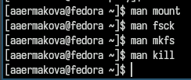

# Выводы

В ходе выполнения данной лабораторной работы я ознакомилась с файловой системой Linux, её структурой, именами и содержанием 
каталогов. Приобрела практические навыки по применению команд для работы с файлами и каталогами, по управлению процессами 
(и работами), по проверке использования диска и обслуживанию файловой системы.

