---
## Front matter
title: "Отчет по лабораторной работе №7"
subtitle: "Операционные системы"
author: "Ермакова Анастасия Алексеевна"

## Generic otions
lang: ru-RU
toc-title: "Содержание"

## Bibliography
bibliography: bib/cite.bib
csl: pandoc/csl/gost-r-7-0-5-2008-numeric.csl

## Pdf output format
toc: true # Table of contents
toc-depth: 2
lof: true # List of figures
lot: true # List of tables
fontsize: 12pt
linestretch: 1.5
papersize: a4
documentclass: scrreprt
## I18n polyglossia
polyglossia-lang:
  name: russian
  options:
	- spelling=modern
	- babelshorthands=true
polyglossia-otherlangs:
  name: english
## I18n babel
babel-lang: russian
babel-otherlangs: english
## Fonts
mainfont: IBM Plex Serif
romanfont: IBM Plex Serif
sansfont: IBM Plex Sans
monofont: IBM Plex Mono
mathfont: STIX Two Math
mainfontoptions: Ligatures=Common,Ligatures=TeX,Scale=0.94
romanfontoptions: Ligatures=Common,Ligatures=TeX,Scale=0.94
sansfontoptions: Ligatures=Common,Ligatures=TeX,Scale=MatchLowercase,Scale=0.94
monofontoptions: Scale=MatchLowercase,Scale=0.94,FakeStretch=0.9
mathfontoptions:
## Biblatex
biblatex: true
biblio-style: "gost-numeric"
biblatexoptions:
  - parentracker=true
  - backend=biber
  - hyperref=auto
  - language=auto
  - autolang=other*
  - citestyle=gost-numeric
## Pandoc-crossref LaTeX customization
figureTitle: "Рис."
tableTitle: "Таблица"
listingTitle: "Листинг"
lofTitle: "Список иллюстраций"
lotTitle: "Список таблиц"
lolTitle: "Листинги"
## Misc options
indent: true
header-includes:
  - \usepackage{indentfirst}
  - \usepackage{float} # keep figures where there are in the text
  - \floatplacement{figure}{H} # keep figures where there are in the text
---

# Цель работы

Целью данной лабораторной работы является ознакомление с файловой системой Linux, её структурой, именами и содержанием к
аталогов. Приобретение практических навыков по применению команд для работы с файлами и каталогами, по управлению процессами 
(и работами), по проверке использования диска и обслуживанию файловой системы.

# Задание

1. Выполнить все примеры из лабораторной работы
2. Выполнить команды по копированию, созданию и перемещению файлов и каталогов
3. Определить опции команды chmod
4. Изменить права доступа к файлам
5. Прочитать документацию о командах mount, fsck, mkfs, kill

# Теоретическое введение

Для создания текстового файла можно использовать команду touch. Для просмотра файлов небольшого размера можно использовать команду cat. Для просмотра файлов постранично удобнее использовать команду less. Команда cp используется для копирования файлов и каталогов. Команды mv и mvdir предназначены для перемещения и переименования файлов и каталогов.

Каждый файл или каталог имеет права доступа. В сведениях о файле или каталоге указываются:

– тип файла (символ (-) обозначает файл, а символ (d) — каталог);

– права для владельца файла (r — разрешено чтение, w — разрешена запись, x — разрешено выполнение, - — право доступа отсутствует);

– права для членов группы (r — разрешено чтение, w — разрешена запись, x — разрешено выполнение, - — право доступа отсутствует);

– права для всех остальных (r — разрешено чтение, w — разрешена запись, x — разрешено выполнение, - — право доступа отсутствует).

Права доступа к файлу или каталогу можно изменить, воспользовавшись командой chmod. Сделать это может владелец файла (или каталога) или пользователь с правами администратора.

Файловая система в Linux состоит из фалов и каталогов. Каждому физическому носителю соответствует своя файловая система. Существует несколько типов файловых систем. Перечислим наиболее часто встречающиеся типы:

– ext2fs (second extended filesystem);

– ext2fs (third extended file system);

– ext4 (fourth extended file system);

– ReiserFS;

– xfs;

– fat (file allocation table);

– ntfs (new technology file system).

Для просмотра используемых в операционной системе файловых систем можно вос- пользоваться командой mount без параметров.

# Выполнение лабораторной работы

Выполняю все примеры, приведенные в первой части описания лабораторной работы (рис. [-@fig:001] - [-@fig:002]).

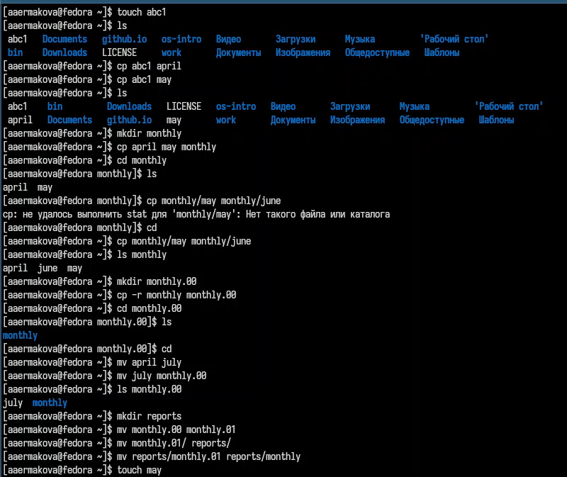{#fig:001 width=70%}

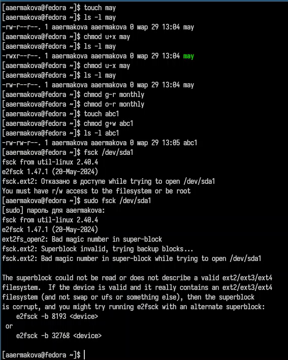{#fig:002 width=70%}

Копирую файл в домашний каталог с новым именем, создаю новую пустую директорию, перемещаю файл в эту директорию, 
переименовываю файл (рис. [-@fig:003]).

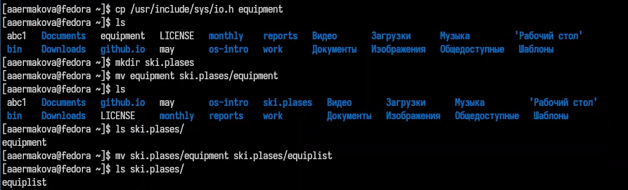{#fig:003 width=70%}

Создаю новый файл, копирую его в новую директорию, но уже сразу с новым именем. Создаю внутри этого каталога подкаталог, 
перемещаю файлы в подкаталог (рис. [-@fig:004]).

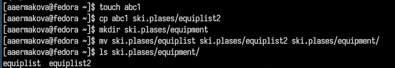{#fig:004 width=70%}

Создаю новую директорию, в этой же строчке перемещаю ее с новым именем в директорию, созданную в прошлый раз (рис. [-@fig:005]).

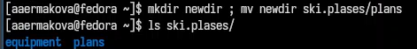{#fig:005 width=70%}

Проверяю, какие права нужно поменять и как, чтобу у новой директория были нужные по заданию права (рис. [-@fig:006]).

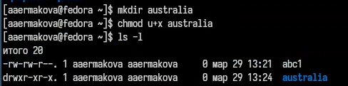{#fig:006 width=70%}

Проверяю, какие права нужно поменять и как, чтобу у новых файлов были нужные по заданию права (рис. [-@fig:007]).

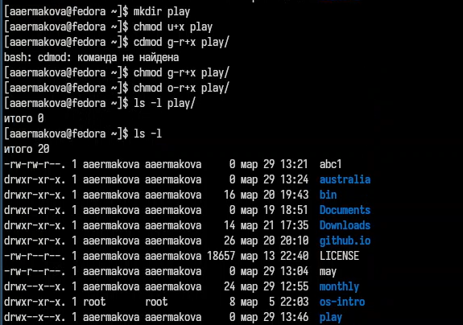{#fig:007 width=70%}

Создаю файл, добавляю в правах доступа право но исполнение и убираю право на запись для владельца, затем создаю следующий файл, ему в правах доступа добавляю право на запись для группы (рис. [-@fig:008]).

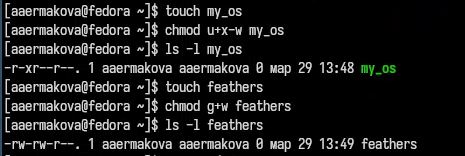{#fig:008 width=70%}

Читаю содержимое файла (рис. [-@fig:009]).

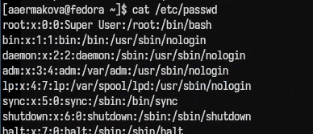{#fig:009 width=70%}

Копирую файл с новым именем, перемещаю его в ранее созданную директорию, рекурсивно ее копирую с новым именем, рекурсивно копирую в нее скопированную до этого папку (рис. [-@fig:010]).

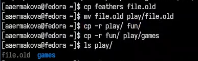{#fig:010 width=70%}

Убираю право на чтение у файла для создателя, поэтому не могу его прочесть, также не могу его скопировать, потому что отказано в доступе на чтение, возвращаю все права (рис. [-@fig:011]).

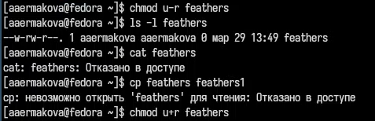{#fig:011 width=70%}

Убираю у директории право на исполнение для пользователя, пытаюсь в нее войти - отказано в доступе, возвращаю все права (рис. [-@fig:012]).

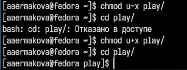{#fig:012 width=70%}

Я прочитала описание каждой из четырех команд с помощью man (рис. [-@fig:013]).

mount — утилита командной строки в UNIX-подобных операционных системах. Применяется для монтирования файловых систем.
fsck (проверка файловой системы) - это утилита командной строки, которая позволяет выполнять проверки согласованности и интерактивное исправление в одной или нескольких файловых системах Linux. Он использует программы, специфичные для типа файловой системы, которую он проверяет.
mkfs используется для создания файловой системы Linux на некотором устройстве, обычно в разделе жёсткого диска. В качестве аргумента filesys для файловой системы может выступать или название устройства
Команда Kill посылает указанный сигнал указанному процессу. Если не указано ни одного сигнала, посылается сигнал SIGTERM. Сигнал SIGTERM завершает лишь те процессы, которые не обрабатывают его приход. Для других процессов может быть необходимым послать сигнал SIGKILL, поскольку этот сигнал перехватить невозможно.

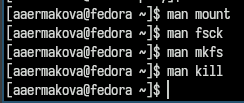{#fig:013 width=70%}

# Выводы

В ходе выполнения данной лабораторной работы я ознакомилась с файловой системой Linux, её структурой, именами и содержанием 
каталогов. Приобрела практические навыки по применению команд для работы с файлами и каталогами, по управлению процессами 
(и работами), по проверке использования диска и обслуживанию файловой системы.

# Список литературы

::: {#refs}
:::
