---
## Front matter
lang: ru-RU
title: Лабораторная работа №8
subtitle: Операционные системы
author:
  - Ермакова А. А.
institute:
  - Российский университет дружбы народов, Москва, Россия
date: 03 апреля 2025

## i18n babel
babel-lang: russian
babel-otherlangs: english

## Formatting pdf
toc: false
toc-title: Содержание
slide_level: 2
aspectratio: 169
section-titles: true
theme: metropolis
header-includes:
 - \metroset{progressbar=frametitle,sectionpage=progressbar,numbering=fraction}
---

# Информация

## Докладчик

:::::::::::::: {.columns align=center}
::: {.column width="70%"}

  * Ермакова Анастасия Алексеевна, НКАбд-02-24
  * студентка факультета физико-математических и естественных наук
  * Российский университет дружбы народов
  * [1132246718@rudn.ru](mailto:1132246718@rudn.ru)
  * <https://aannyyaa1.github.io/ru/>

:::
::: {.column width="30%"}

:::
::::::::::::::

## Цель работы

Цель данной лабораторной работы - ознакомление с инструментами поиска файлов и фильтрации текстовых данных.
Приобретение практических навыков: по управлению процессами (и заданиями), по
проверке использования диска и обслуживанию файловых систем.

## Задание

1. Осуществите вход в систему, используя соответствующее имя пользователя.
2. Запишите в файл file.txt названия файлов, содержащихся в каталоге /etc. Допишите в этот же файл названия файлов, содержащихся в вашем домашнем каталоге.
3. Выведите имена всех файлов из file.txt, имеющих расширение .conf, после чего
запишите их в новый текстовой файл conf.txt.
4. Определите, какие файлы в вашем домашнем каталоге имеют имена, начинавшиеся
с символа c? Предложите несколько вариантов, как это сделать.
5. Выведите на экран (по странично) имена файлов из каталога /etc, начинающиеся
с символа h.
6. Запустите в фоновом режиме процесс, который будет записывать в файл ~/logfile
файлы, имена которых начинаются с log.
7. Удалите файл ~/logfile.
8. Запустите из консоли в фоновом режиме редактор gedit.
9. Определите идентификатор процесса gedit, используя команду ps, конвейер и фильтр
grep. Как ещё можно определить идентификатор процесса?
10. Прочтите справку (man) команды kill, после чего используйте её для завершения
процесса gedit.
11. Выполните команды df и du, предварительно получив более подробную информацию
об этих командах, с помощью команды man.
12. Воспользовавшись справкой команды find, выведите имена всех директорий, имеющихся в вашем домашнем каталоге.

## Теоретическое введение

В интерфейсе командной строки есть очень полезная возможность перенаправления (переадресации) ввода и вывода (англ. термин I/O Redirection). Как мы уже заметили, многие программы выводят данные на экран. А ввод данных в терминале осуществляется с клавиатуры. С помощью специальных обозначений можно перенаправить вывод многих команд в файлы или иные устройства вывода (например, распечатать на принтере). Тоже самое и со вводом информации, вместо ввода данных с клавиатуры, для многих программ можно задать считывание символов их файла. Кроме того, можно даже вывод одной программы передать на ввод другой программе.

К каждой программе, запускаемой в командной строке, по умолчанию подключено три потока данных:

STDIN (0) — стандартный поток ввода (данные, загружаемые в программу). STDOUT (1) — стандартный поток вывода (данные, которые выводит программа). По умолчанию — терминал. STDERR (2) — стандартный поток вывода диагностических и отладочных сообщений (например, сообщениях об ошибках). По умолчанию — терминал.

Pipe (конвеер) – это однонаправленный канал межпроцессного взаимодействия. Термин был придуман Дугласом Макилроем для командной оболочки Unix и назван по аналогии с трубопроводом. Конвейеры чаще всего используются в shell-скриптах для связи нескольких команд путем перенаправления вывода одной команды (stdout) на вход (stdin) последующей, используя символ конвеера ‘|’.

# Выполнение лабораторной работы
## Осуществление входа в систему

Вошла в систему под соответствующем именем пользователя.

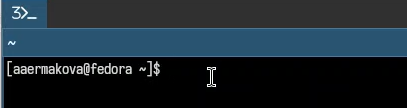

## Работа с файлом file.txt

Открыла терминал, записала в файл file.txt названия файлов из каталога /etc с помощью перенаправления ">" (и файл создала, и записала в него то, что могло быть выведено ls -lR /etc). В файл я добавила также все файлы из подкаталогов.

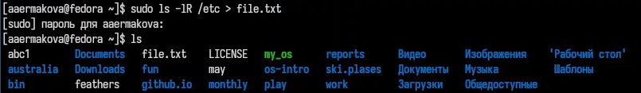

## Работа с файлом file.txt

Проверила, что в файл записались нужные значения с помощью утилиты head, она выводит первые 10 строк файла на экран.

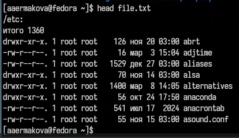

## Работа с файлом file.txt

Добавила в созданный файл имена файлов из домашнего каталога, используя перенаправление ">>" в режиме добавления.

## Работа с файлом file.txt

Вывела на экран имена всех файлов, имеющих расширение ".conf" с помощью утилиты grep.

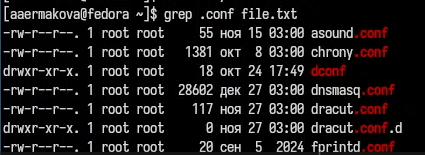

## Работа с файлом conf.txt

Добавила вывод прошлой команды в новый файл conf.txt с помощью перенаправления ">" (файл создается при выполнении этой команды).

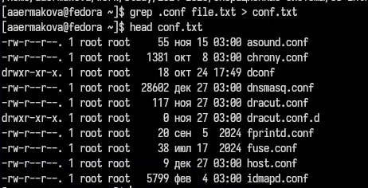

## Использование команды find

Определяю,какие файлы в домашнем каталоге начинаютя с символа "c" с помощью утилиты find, прописываю ей в аргументах домашнюю директорию (тогда вывод относительно корневого каталога, а не домашнего будет), выбираю опцию -name (ищем по имени), и пишу маску, по которой будем искать имя, где * - любое кол-во любых символов, добавляю опцию -print, чтобы мне вывелся результат. Но таким образом я получаю информацию даже о файлах из подкаталогов домашнего каталога.

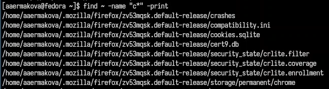

## Использование команды ls

Второй способ использовать утилиту ls -lR и использовать grep, чтобы найти элементы с первым символом c. Однако этот способ не работает для поиска файлов из подкаталогов каталога.

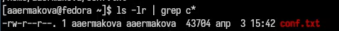

## Использование команды find

С помощью метода find, чьи опции я расписала ранее, ищу все файлы, начинающиеся с буквы "h".

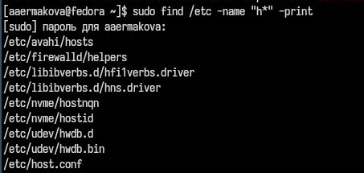

## Использование команды find

Запускаю в фоновом режиме (на это указывает символ &) процесс, который будет записывать в файл logfile (с помощью перенаправления >) файлы, имена которых начинаются с log.

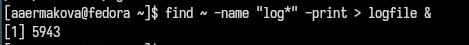

## Использование команды ls

Проверяю, что файл создан, удаляю его, проверяю, что файл удален.

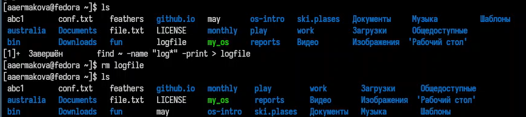

## Создание фонового процесса

Запускаю в консоли в фоновом режиме (с помощью символа &) редактор mousepad.

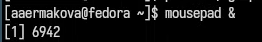

## Поиск идентификатора процесса

С помощью утилиты ps определяю идентификатор процесса mousepad, его значение 6942. Также мы можем определить идентификатор с помощью pgrep.

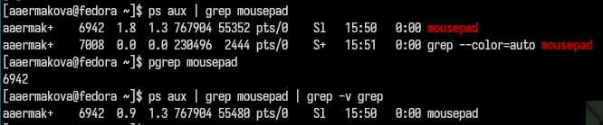

## Чтение документации

Прочитала справку команды kill.

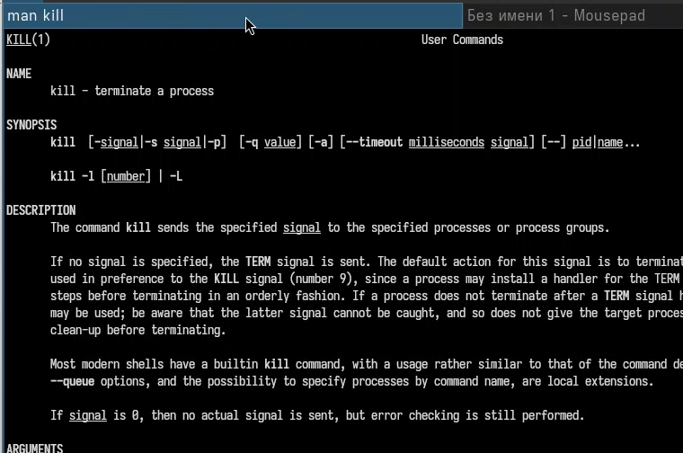

## Удаление процесса

Использую команду kill и идентификатор процесса, чтобы его удалить.

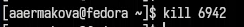

## Чтение документации

Прочитала документацию про функции df и du.

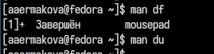

## Утилита df

Использую утилиту df опции -iv позволяют увидеть информацию об инодах и сделать вывод читаемым, игнорируя сообщения системы о нем. Эта утилита нам нужна, чтобы выяснить, сколько свободного места есть у нашей системы.

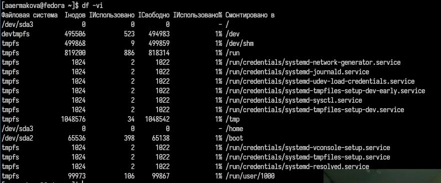

## Утилита du

Использую утилиту du. Она нужна чтобы просмотреть, сколько места занимают файлы в определенной директории и найти самые большие из них.

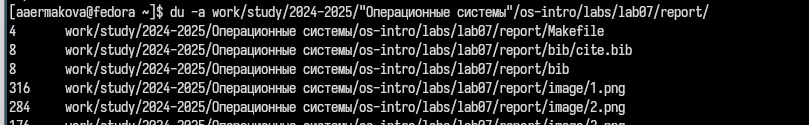

## Чтение документации

Прочитала документацию о команде find.

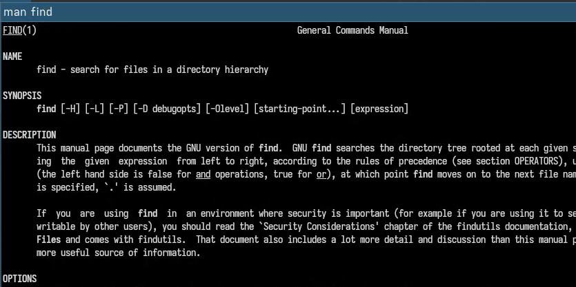

## Использование команды find

Вывела имена всех директорий, имеющихся в моем домашнем каталоге, используя аргумент d у утилиты find опции -type, то есть указываю тип файлов, который мне нужен и этот тип Директория. Утилита -а позволит увидеть размер всех файлов, а не только директорий.

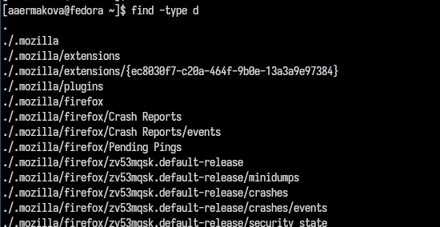

# Выводы

В результате данной лабораторной работы я ознакомилась с инструментами поиска файлов и фильтрации текстовых данных, а также приобрела практические навыки по управлению процессами (и заданиями), по проверке использования диска и по обслуживанию файловых систем.

