---
## Front matter
lang: ru-RU
title: Второй этап проекта
subtitle: Операционные системы
author:
  - Ермакова А. А.
institute:
  - Российский университет дружбы народов, Москва, Россия
date: 21 марта 2025

## i18n babel
babel-lang: russian
babel-otherlangs: english

## Formatting pdf
toc: false
toc-title: Содержание
slide_level: 2
aspectratio: 169
section-titles: true
theme: metropolis
header-includes:
 - \metroset{progressbar=frametitle,sectionpage=progressbar,numbering=fraction}
---

# Информация

## Докладчик

:::::::::::::: {.columns align=center}
::: {.column width="70%"}

  * Ермакова Анастасия Алексеевна, НКАбд-02-24
  * студентка факультета физико-математических и естественных наук
  * Российский университет дружбы народов
  * [1132246718@rudn.ru](mailto:1132246718@rudn.ru)
  * <https://aannyyaa1.github.io/ru/>

:::
::: {.column width="30%"}

:::
::::::::::::::

# Цель работы

Продолжить работу с сайтом, редактировать его в соответствии с требованиями, добавить данные о себе на сайт.

# Задание

1. Разместить фотографию владельца сайта.
2. Разместить краткое описание владельца сайта (Biography).
3. Добавить информацию об интересах (Interests).
4. Добавить информацию от образовании (Education).
5. Сделать пост по прошедшей неделе.
6. Добавить пост на тему по выбору:
   - Управление версиями. Git.
   - Непрерывная интеграция и непрерывное развертывание (CI/CD).

# Выполнение проекта
## Работа с файлом с данными о себе

Загружаю в каталог свою фотографию, переименовываю ее в avatar.

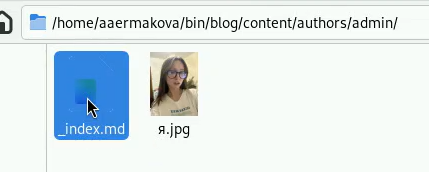

## Работа с файлом с данными о себе

Начинаю редактирование файла index.md со своими данными. Ввожу свои имя и фамилию.

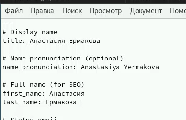

## Работа с файлом с данными о себе

Пишу свою роль студента РУДН.

## Работа с файлом с данными о себе

Ввожу ссылку на свой гитхаб и свою почту.

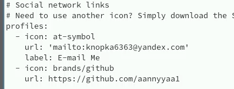

## Работа с файлом с данными о себе

Редактирую интересы.

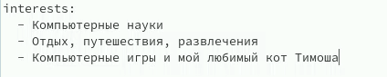

## Работа с файлом с данными о себе

И данные о моем образовании.

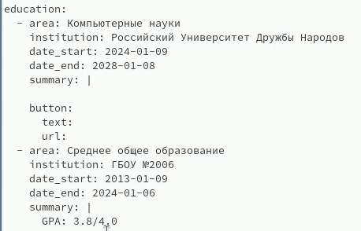

## Работа с файлом с данными о себе

Пишу немного о себе.

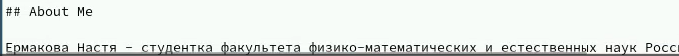

## Работа с файлом с данными о себе

Сохраняю изменения в файле и отправляю на гитхаб.

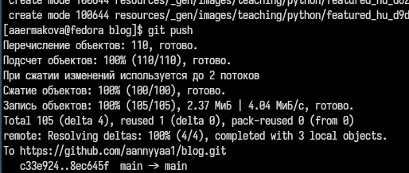

## Работа с файлом с данными о себе

Запускаю бинарный файл и перехожу на свой сайт. Все сделано верно.

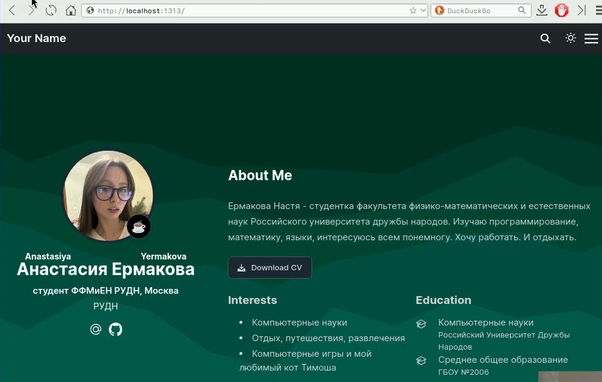

## Работа с файлом с постом на тему по выбору

Далее редактирую файл и пишу пост об управлением версиями гит.

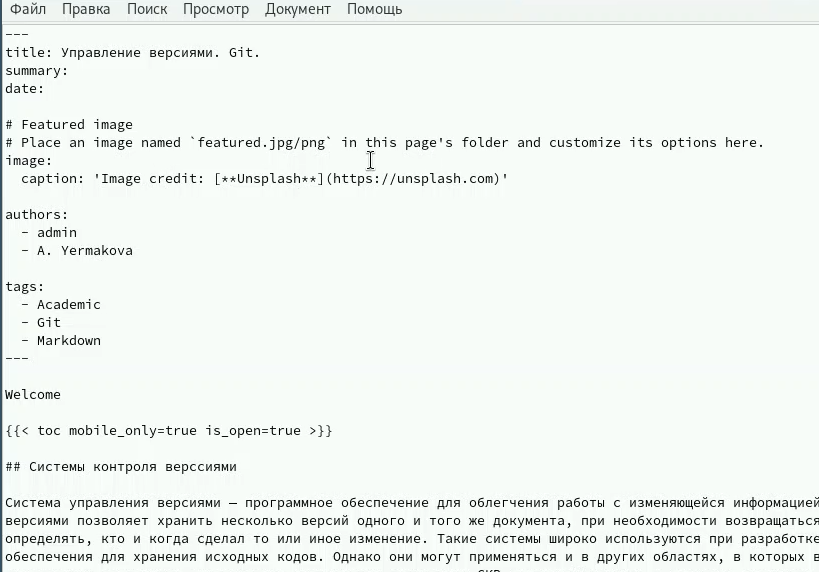

## Работа с файлом с постом на тему по выбору

Сохраняю изменения, отправляю все на гитхаб и проверяю результат на сайте. Вот мой пост.

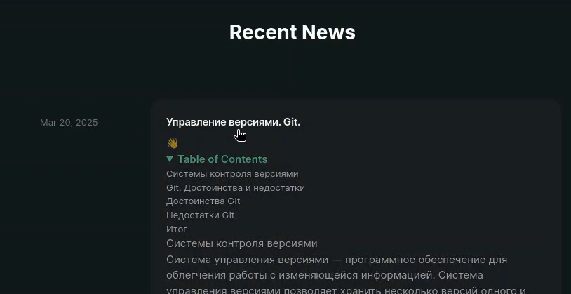

## Работа с файлом с постом на тему по выбору

Перехожу по нему. Фотография тоже прикрепилась.

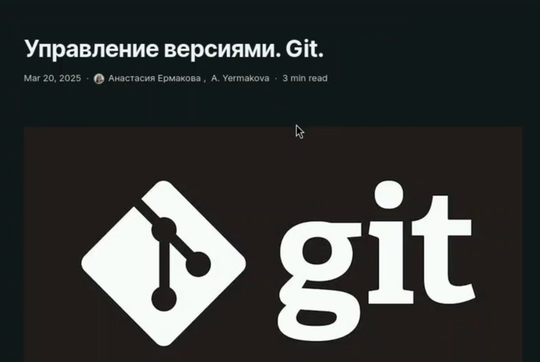

## Работа с файлом с постом по прошедшей неделе

Создаю папку post1 для хранения файлов для первого поста по прошедшей неделе.

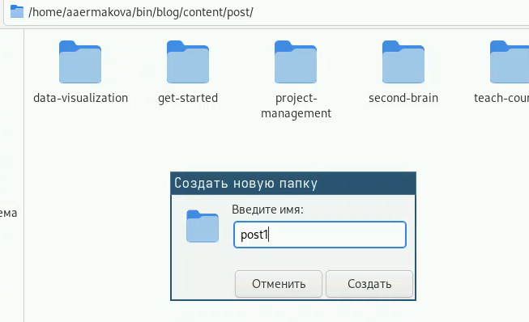

## Работа с файлом с постом по прошедшей неделе

Редактирую файл, пишу о своей неделе.

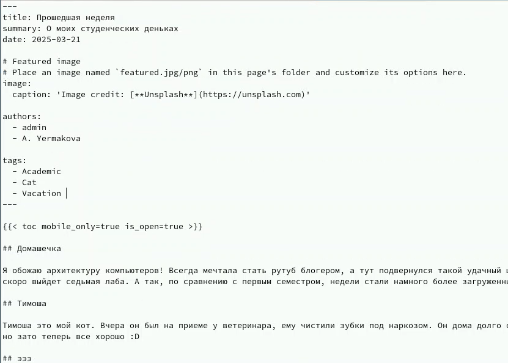

## Работа с файлом с постом по прошедшей неделе

Сохраняю изменения и отправляю на гитхаб. Проверяю на сайте, все верно.

# Выводы

Я продолжила работу с сайтом, редактировала его в соответствии с требованиями, добавила данные о себе на сайт.
