---
## Front matter
title: "Отчет по второму этапу проекта"
subtitle: "Операционные системы"
author: "Ермакова Анастасия Алексеевна"

## Generic otions
lang: ru-RU
toc-title: "Содержание"

## Bibliography
bibliography: bib/cite.bib
csl: pandoc/csl/gost-r-7-0-5-2008-numeric.csl

## Pdf output format
toc: true # Table of contents
toc-depth: 2
lof: true # List of figures
lot: true # List of tables
fontsize: 12pt
linestretch: 1.5
papersize: a4
documentclass: scrreprt
## I18n polyglossia
polyglossia-lang:
  name: russian
  options:
	- spelling=modern
	- babelshorthands=true
polyglossia-otherlangs:
  name: english
## I18n babel
babel-lang: russian
babel-otherlangs: english
## Fonts
mainfont: IBM Plex Serif
romanfont: IBM Plex Serif
sansfont: IBM Plex Sans
monofont: IBM Plex Mono
mathfont: STIX Two Math
mainfontoptions: Ligatures=Common,Ligatures=TeX,Scale=0.94
romanfontoptions: Ligatures=Common,Ligatures=TeX,Scale=0.94
sansfontoptions: Ligatures=Common,Ligatures=TeX,Scale=MatchLowercase,Scale=0.94
monofontoptions: Scale=MatchLowercase,Scale=0.94,FakeStretch=0.9
mathfontoptions:
## Biblatex
biblatex: true
biblio-style: "gost-numeric"
biblatexoptions:
  - parentracker=true
  - backend=biber
  - hyperref=auto
  - language=auto
  - autolang=other*
  - citestyle=gost-numeric
## Pandoc-crossref LaTeX customization
figureTitle: "Рис."
tableTitle: "Таблица"
listingTitle: "Листинг"
lofTitle: "Список иллюстраций"
lotTitle: "Список таблиц"
lolTitle: "Листинги"
## Misc options
indent: true
header-includes:
  - \usepackage{indentfirst}
  - \usepackage{float} # keep figures where there are in the text
  - \floatplacement{figure}{H} # keep figures where there are in the text
---

# Цель работы

Продолжить работу с сайтом, редактировать его в соответствии с требованиями, добавить данные о себе на сайт.

# Задание

1. Разместить фотографию владельца сайта.
2. Разместить краткое описание владельца сайта (Biography).
3. Добавить информацию об интересах (Interests).
4. Добавить информацию от образовании (Education).
5. Сделать пост по прошедшей неделе.
6. Добавить пост на тему по выбору:
   - Управление версиями. Git.
   - Непрерывная интеграция и непрерывное развертывание (CI/CD).

# Выполнение лабораторной работы

Загружаю в каталог свою фотографию, переименовываю ее в avatar (рис. [-@fig:001]).

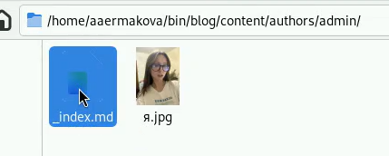{#fig:001 width=70%}

Начинаю редактирование файла index.md со своими данными. Ввожу свои имя и фамилию (рис. [-@fig:002]).

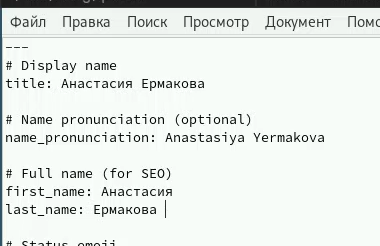{#fig:002 width=70%}

Пишу свою роль студента РУДН (рис. [-@fig:003]).

{#fig:003 width=70%}

Ввожу ссылку на свой гитхаб и свою почту (рис. [-@fig:004]).

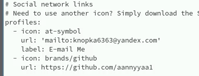{#fig:004 width=70%}

Редактирую интересы (рис. [-@fig:005]).

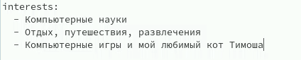{#fig:005 width=70%}

И данные о моем образовании (рис. [-@fig:006]).

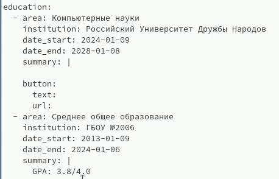{#fig:006 width=70%}

Пишу немного о себе (рис. [-@fig:007]).

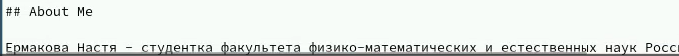{#fig:007 width=70%}

Сохраняю изменения в файле и отправляю на гитхаб (рис. [-@fig:008]).

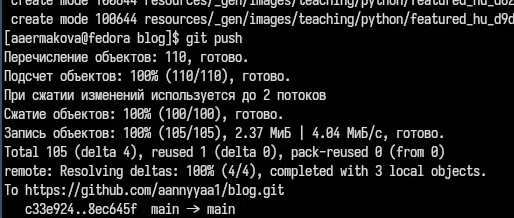{#fig:008 width=70%}

Запускаю бинарный файл и перехожу на свой сайт. Все сделано верно (рис. [-@fig:009]).

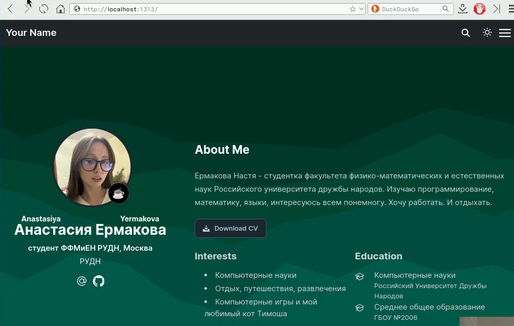{#fig:009 width=70%}

Далее редактирую файл и пишу пост об управлением версиями гит (рис. [-@fig:010]).

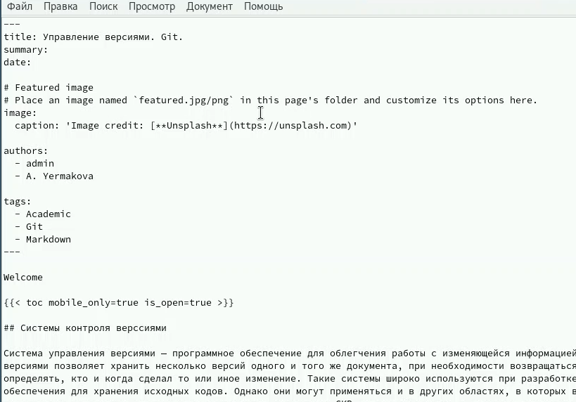{#fig:010 width=70%}

Сохраняю изменения, отправляю все на гитхаб и проверяю результат на сайте. Вот мой пост (рис. [-@fig:011]).

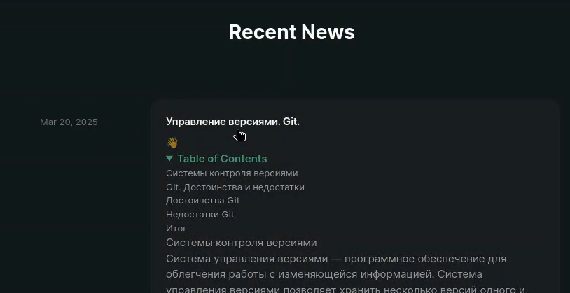{#fig:011 width=70%}

Перехожу по нему. Фотография тоже прикрепилась (рис. [-@fig:012]).

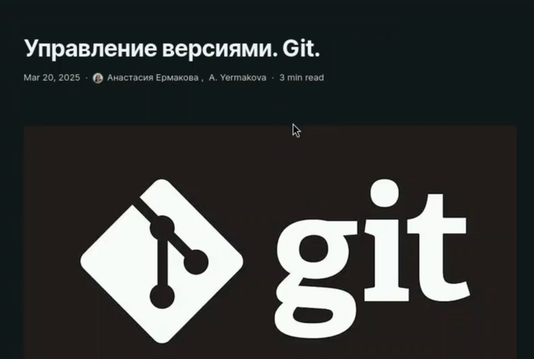{#fig:012 width=70%}

Создаю папку post1 для хранения файлов для первого поста по прошедшей неделе (рис. [-@fig:013]).

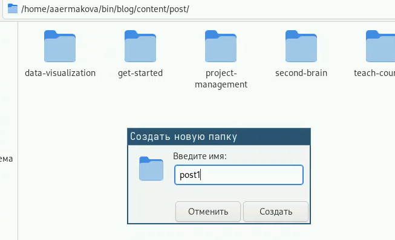{#fig:013 width=70%}

Редактирую файл, пишу о своей неделе (рис. [-@fig:014]).

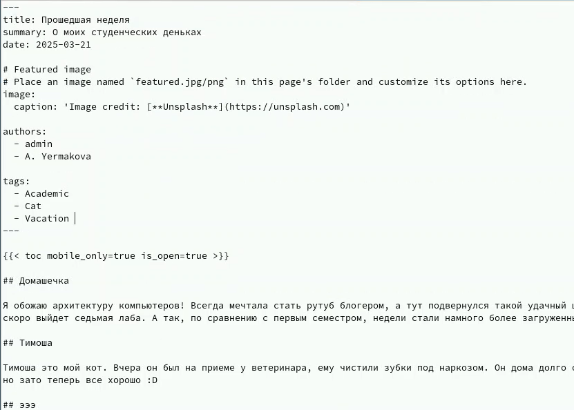{#fig:014 width=70%}

Сохраняю изменения и отправляю на гитхаб. Проверяю на сайте, все верно (рис. [-@fig:015]).

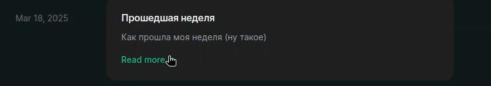{#fig:015 width=70%}

# Выводы

Я продолжила работу с сайтом, редактировала его в соответствии с требованиями, добавила данные о себе на сайт.

# Список литературы

::: {#refs}
:::
